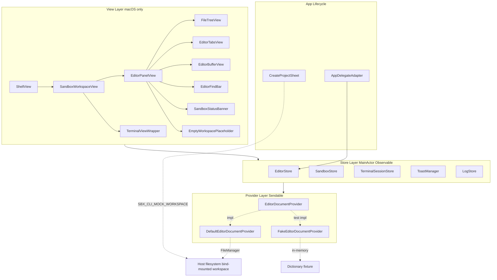
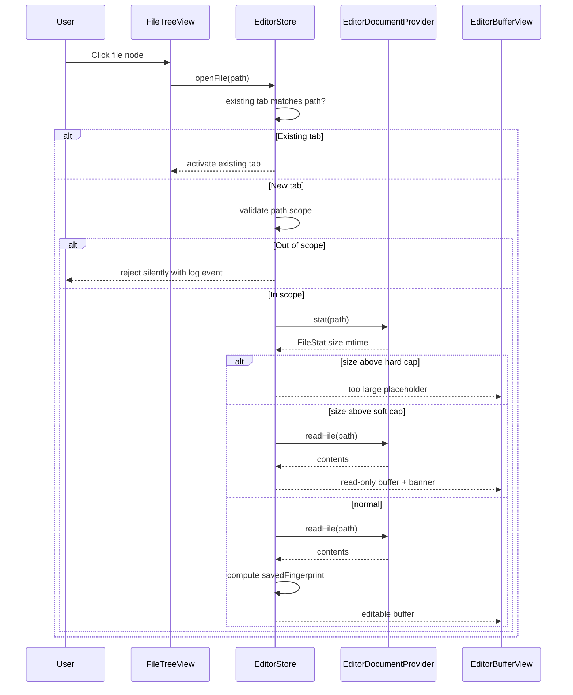
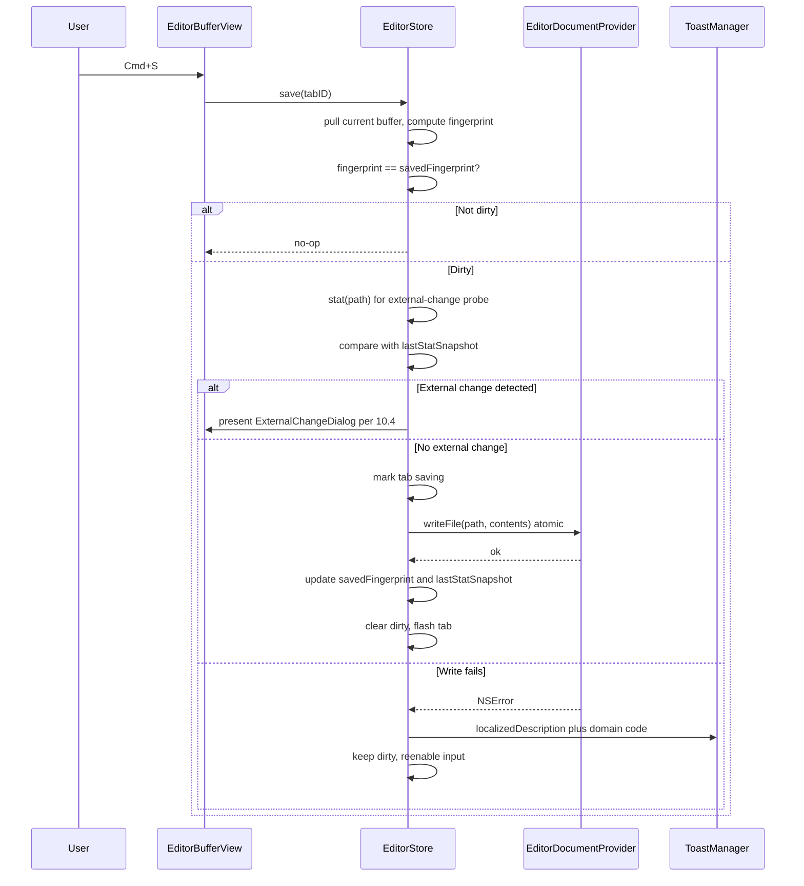
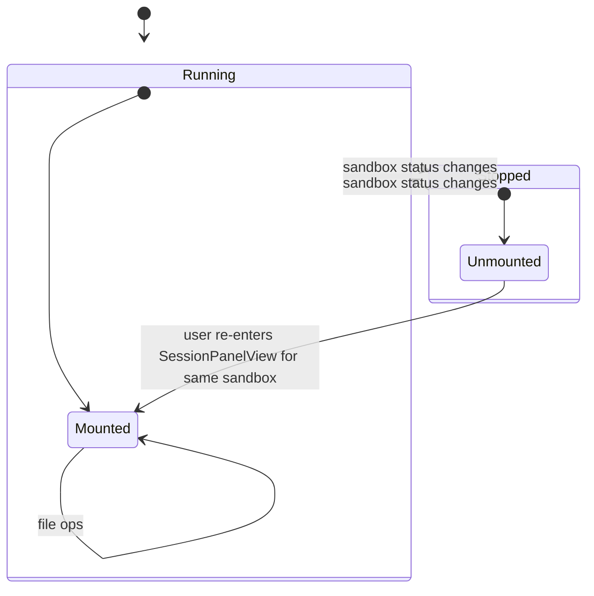
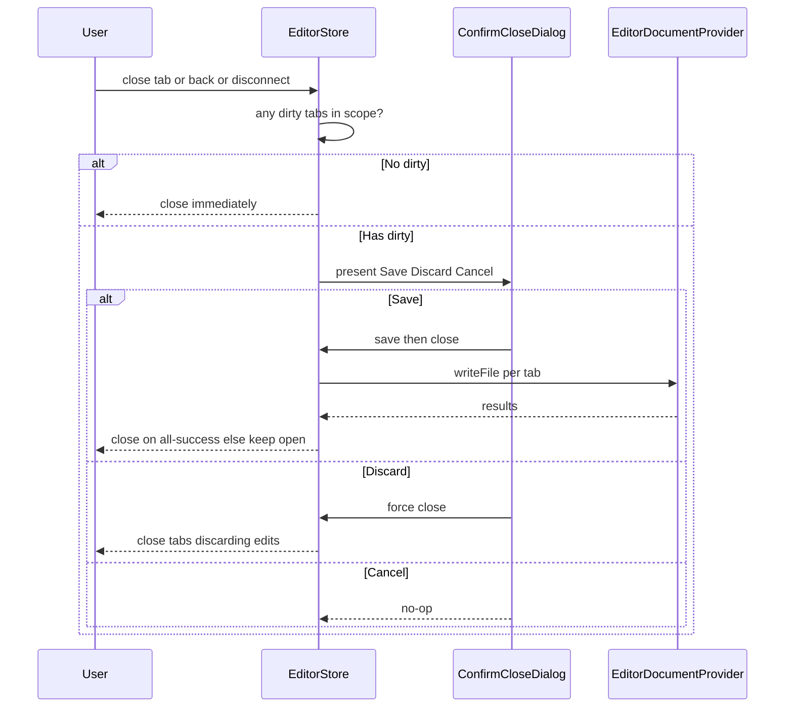
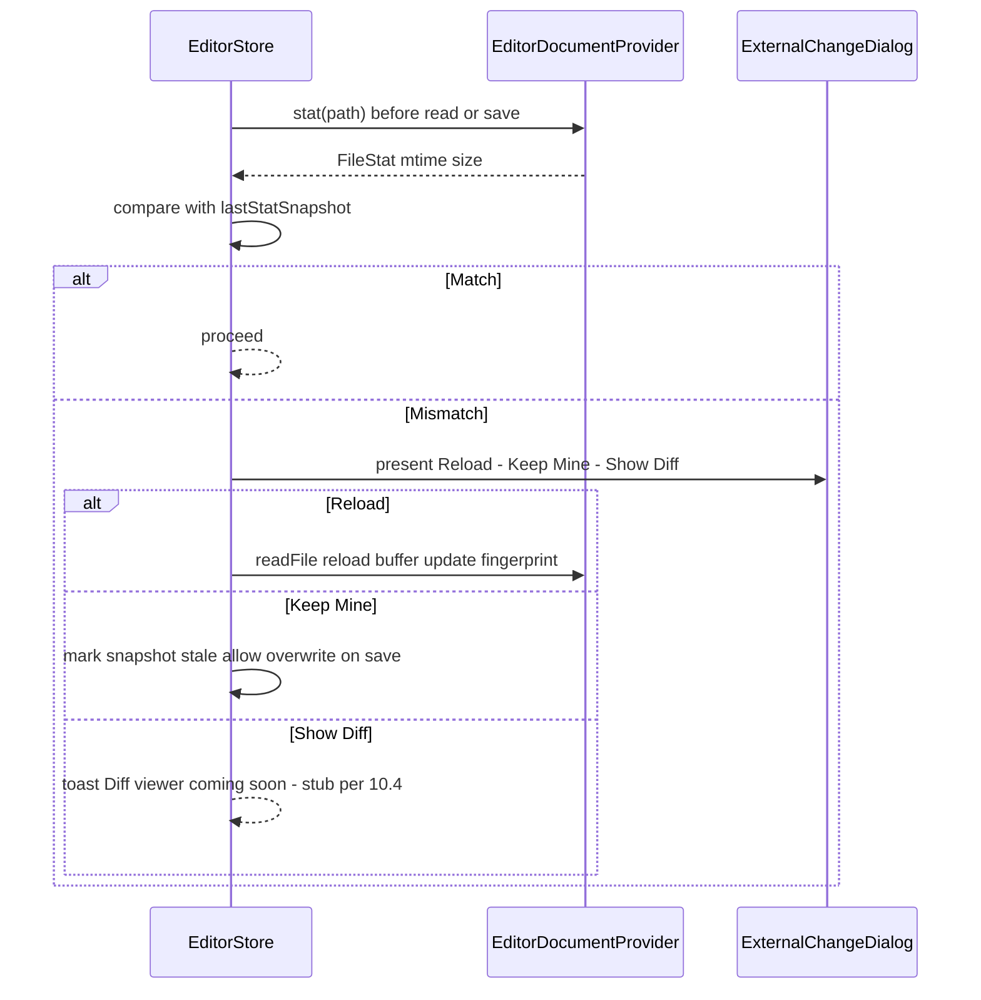
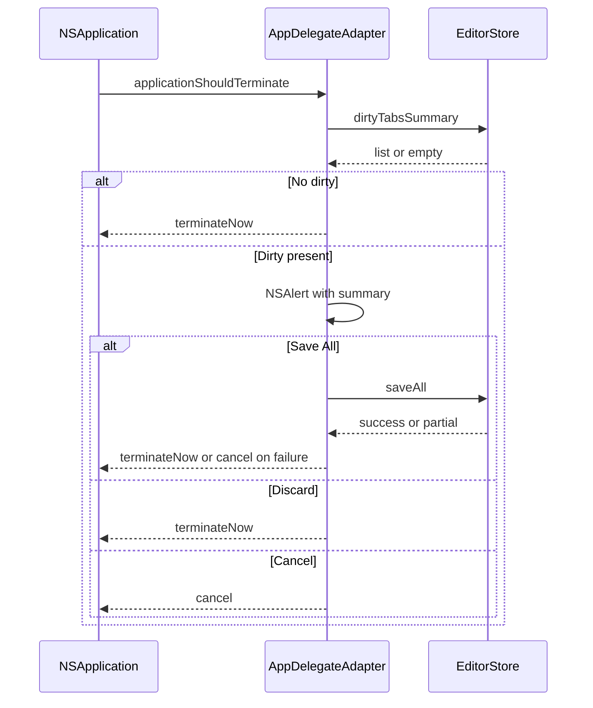
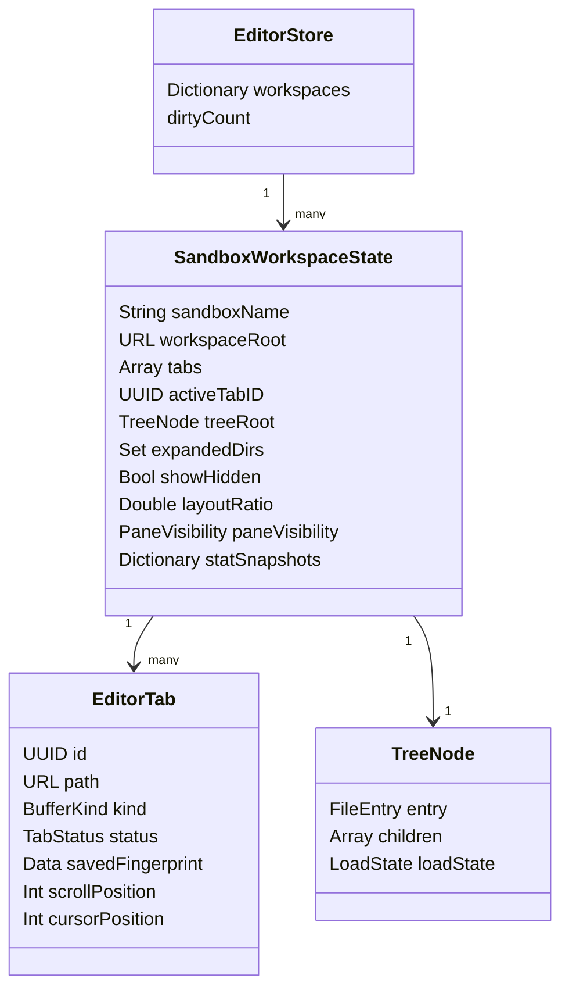

# Design Document — `editor`

## Overview

**Purpose**: The `editor` feature delivers an in-app, VSCode-style code-editing surface to sbx-ui users, letting them browse and modify files in a sandbox workspace without leaving the app or dropping into a terminal.

**Users**: sbx-ui developers who today edit workspace files by shelling into `sbx exec <name> bash` or by opening the bind-mounted workspace in an external editor. The editor keeps them in the same window as the agent terminal, so they can watch the agent act on a file and intervene in real time.

**Impact**: Introduces a new sandbox-scoped split-pane layout (`SandboxWorkspaceView`) wrapping the existing terminal view, adds an `EditorStore` plus a focused set of SwiftUI views under `Views/Editor/`, and introduces an `EditorDocumentProvider` seam backed by a `FileManager` implementation. **File I/O goes directly through the host filesystem** against `Sandbox.workspace`; no `SbxServiceProtocol` changes and no `tools/mock-sbx` changes are required. One small edit to `CreateProjectSheet.swift` adds an `SBX_CLI_MOCK_WORKSPACE` env var so E2E tests can point each run at an isolated fixture directory.

### Goals
- Provide read, edit, and save for UTF-8 files in the sandbox workspace from within the app, reachable in one click from a running sandbox's session panel.
- Model the split-pane layout as an N-pane container so future features (preview, diff, logs) can slot in as additional pane types without restructuring `SessionPanelView`.
- Introduce `EditorDocumentProvider` so unit tests run against an in-memory fake and E2E tests run against a per-test temp-dir workspace — no Docker required, and no additional mock plumbing.
- Hold the line on the Technical Monolith design system: zero new tokens, zero new font stacks, no light-mode assets.

### Non-Goals
- Container-scoped file I/O via `sbx exec cat | tee | ls | stat`. The editor deliberately bypasses the container because it does not process untrusted prompts and the workspace is already a bind-mount the user edits with other host tools.
- Full VSCode parity: no extensions, marketplace, debugger, LSP/IntelliSense, git UI, minimap, multi-cursor, project-wide find-and-replace, binary/image preview panes, drag-drop between tabs.
- Editing files outside `Sandbox.workspace` (for example `/etc`, `/tmp`). The path-scope guard rejects such requests.
- Auto-save. Saves are explicit per 5.6.
- Persisting open tabs across app relaunch. Session-scoped only per 6.6.
- Syntax highlighting in MVP. Modeled as feature-flagged optional capability (Requirement 7).
- Real-time file-system watching. MVP uses poll-on-next-read for external-change detection per 10.4; `FSEventStream`-based watching is a follow-up spec.

## Requirements Traceability

| Requirement | Summary | Components | Interfaces | Flows |
|-------------|---------|------------|------------|-------|
| 1.1 | Split pane inside SessionPanelView | SandboxWorkspaceView, EditorPanelView | — | Open sandbox flow |
| 1.2 | Editor leading, terminal trailing, draggable splitter | SandboxWorkspaceView | SplitLayoutRatio | — |
| 1.3 | Persist split ratio per sandbox for app session | EditorStore | EditorStore.setLayoutRatio | — |
| 1.4 | Collapse each pane independently | SandboxWorkspaceView, EditorStore | EditorStore.setPaneVisibility | — |
| 1.5 | No mount / no buffers when no session | ShellView gating, SandboxWorkspaceView | — | — |
| 1.6 | Back button prompts when dirty | SandboxWorkspaceView, EditorStore | EditorStore.closeSandbox | Close-with-dirty flow |
| 2.1 | Collapsible tree rooted at Sandbox.workspace | FileTreeView, EditorStore | EditorStore.rootNode | — |
| 2.2 | listDirectory call, dir-first sort | EditorStore, EditorDocumentProvider | EditorDocumentProvider.listDirectory | Open-file flow |
| 2.3 | Click dir toggles, lazy-loads children | FileTreeView, EditorStore | EditorStore.toggleDir | — |
| 2.4 | Click file opens or focuses tab | FileTreeView, EditorStore | EditorStore.openFile | Open-file flow |
| 2.5 | Inline spinner while dir enumeration in flight | FileTreeView | — | — |
| 2.6 | Hidden entries filtered by default + toggle | EditorStore, FileTreeView | EditorStore.showHidden | — |
| 2.7 | listDirectory failure → toast + preserve prior content | EditorStore, ToastManager | — | — |
| 2.8 | Empty / missing workspace → placeholder view | EditorPanelView, EditorStore | — | — |
| 3.1 | readFile → UTF-8 buffer in new tab | EditorStore, EditorDocumentProvider | EditorDocumentProvider.readFile | Open-file flow |
| 3.2 | Skeleton placeholder during read | EditorBufferView | — | — |
| 3.3 | Buffer uses Font.code 13 + line-number gutter | EditorBufferView | — | — |
| 3.4 | Large file → read-only preview mode | EditorStore, EditorBufferView | — | Open-file flow |
| 3.5 | Binary file → hex notice, no buffer | EditorStore, EditorBufferView | — | — |
| 3.6 | Re-open focuses existing tab | EditorStore | EditorStore.openFile | — |
| 3.7 | Out-of-scope path rejected | EditorStore, EditorPath | EditorPath.validate | — |
| 4.1 | Any mutation marks tab dirty | EditorStore, EditorBufferView | EditorStore.onBufferMutated, registerBufferPull | — |
| 4.2 | Dirty glyph + accent-colored title | EditorTabsView | — | — |
| 4.3 | Revert-to-saved via fingerprint clears dirty | EditorStore | EditorStore.updateDirtyState | — |
| 4.4 | Standard macOS shortcuts | EditorBufferView (native widget) | — | — |
| 4.5 | No input during in-flight read | EditorBufferView | — | — |
| 4.6 | Sandbox stops while dirty → preserve buffers, restore on re-entry | EditorStore | EditorStore.syncSandboxStatus | Sandbox-stopped flow |
| 5.1 | Cmd+S → writeFile | EditorStore, EditorDocumentProvider | EditorDocumentProvider.writeFile | Save flow |
| 5.2 | Save-in-flight spinner, buffer disabled | EditorStore, EditorTabsView | — | Save flow |
| 5.3 | Success flash in Color.secondary | EditorTabsView | — | Save flow |
| 5.4 | Save failure keeps dirty, toasts localizedDescription | EditorStore, ToastManager | — | Save flow |
| 5.5 | Save All iterates dirty tabs | EditorStore | EditorStore.saveAll | — |
| 5.6 | No auto-save | EditorStore | — | — |
| 5.7 | Byte-exact round-trip via atomic Data.write | EditorDocumentProvider | Data.write options atomic | Save flow |
| 6.1 | Horizontal tab bar ordered by open time | EditorTabsView, EditorStore | — | — |
| 6.2 | Click tab restores scroll + cursor | EditorStore, EditorBufferView | EditorStore.activateTab | — |
| 6.3 | Cmd+W closes with unsaved guard | EditorStore | EditorStore.closeTab | Close-with-dirty flow |
| 6.4 | Cmd+1..9 activates tab N | EditorTabsView | — | — |
| 6.5 | Overflow dropdown when tabs exceed width | EditorTabsView | — | — |
| 6.6 | Tabs persist per sandbox for session | EditorStore | EditorStore.workspaceState | Sandbox-stopped flow |
| 7.1–7.5 | Syntax highlighting Phase-2 feature flag | EditorBufferView | — | — |
| 8.1–8.7 | Find-within-file bar | EditorFindBar, EditorBufferView | — | Find flow |
| 9.1 | Sibling focus with terminal | SandboxWorkspaceView | — | — |
| 9.2 | Disconnect prompts close-with-dirty | SandboxWorkspaceView, EditorStore | — | Close-with-dirty flow |
| 9.3 | Concurrent host file I/O and PTY (no contention) | EditorStore, TerminalViewWrapper | — | — |
| 9.4 | External change handled per 10.4 | EditorStore | EditorStore.checkExternalChange | External-change flow |
| 9.5 | Editor and terminal do not cross-wire | SandboxWorkspaceView | — | — |
| 10.1 | Close-with-dirty confirmation dialog | EditorStore, ConfirmCloseDialog | — | Close-with-dirty flow |
| 10.2 | Sandbox stop → preserve buffers (no banner) | EditorStore | EditorStore.syncSandboxStatus | Sandbox-stopped flow |
| 10.3 | Return to running → restore tabs | EditorStore | EditorStore.open(sandbox:) | Sandbox-stopped flow |
| 10.4 | External change three-way prompt | EditorStore, ExternalChangeDialog | EditorDocumentProvider.stat | External-change flow |
| 10.5 | Mid-session read failure toasts, keeps tabs | EditorStore, ToastManager | — | — |
| 10.6 | NSError → localizedDescription + domain/code in toast | EditorStore, ToastManager | — | — |
| 10.7 | Quit with dirty → summary prompt | AppDelegateAdapter, EditorStore | NSApplicationDelegate.applicationShouldTerminate | Quit flow |
| 11.1 | 2 MB / 50 k-line read-only threshold | EditorStore | EditorStore.classifyFile | Open-file flow |
| 11.2 | 20 MB hard-block placeholder | EditorStore | EditorStore.classifyFile | Open-file flow |
| 11.3 | Tab UI in ≤150 ms | EditorStore, EditorPanelView | — | — |
| 11.4 | Pending indicator at >250 ms | EditorPanelView | — | — |
| 11.5 | 20-tab open warning | EditorStore | — | — |
| 11.6 | Async tokenization under flag | EditorBufferView | — | — |
| 11.7 | O(1) fingerprint dirty-compare | EditorStore | EditorStore.updateDirtyState | — |
| 12.1–12.5 | Design-system tokens | All editor views | DesignSystem | — |
| 13.1 | EditorDocumentProvider protocol seam | EditorStore, EditorDocumentProvider | — | — |
| 13.2 | EditorStore @Observable @MainActor | EditorStore | — | — |
| 13.3 | Default FileManager provider, alt providers registerable | DefaultEditorDocumentProvider | EditorDocumentProvider | — |
| 13.4 | N-pane container | SandboxWorkspaceView | PaneSlot | — |
| 13.5 | EditorPluginApi surface (reserved) | PluginApiHandler (future extension) | JSON-RPC | — |
| 13.6 | LogStore events for every file op | DefaultEditorDocumentProvider, EditorStore | appLog | — |
| 14.1 | Unit tests for EditorStore | EditorStoreTests | — | — |
| 14.2 | XCUITest E2E | EditorE2ETests | — | Save flow, Open-file flow |
| 14.3 | Per-test temp-dir workspace, no mock-sbx change | CreateProjectSheet, EditorE2ETests | SBX_CLI_MOCK_WORKSPACE env var | — |
| 14.4 | FakeEditorDocumentProvider for unit tests | FakeEditorDocumentProvider | EditorDocumentProvider | — |
| 14.5 | Sandbox-stop-mid-edit E2E | EditorE2ETests | — | Sandbox-stopped flow |
| 14.6 | Deterministic per-test temp dirs | EditorE2ETests | — | — |

## Architecture

### Existing Architecture Analysis

The app already follows the layering documented in `.kiro/steering/structure.md`: `View → Store → Service → CliExecutor`. Views read from `@Observable @MainActor` stores via `.environment(...)` injection; stores are the only reactive layer; services are `Sendable`. Cross-store coupling happens through closures or through `ShellView.onChange(of:)` fan-out, never stored references. `SBXCore` (Models + Services) is compiled by both Xcode and SPM; everything UI-bearing is excluded from the SPM target in `Package.swift`.

The editor reuses — rather than extends — this layering. `EditorStore` is a `@MainActor @Observable` store injected like `SandboxStore` and `KanbanStore`. File I/O sits behind `EditorDocumentProvider`, a new `Sendable` protocol whose default implementation mirrors [KanbanPersistence.swift](sbx-ui/Services/KanbanPersistence.swift) — a small `Sendable` struct using `FileManager.contentsOfDirectory(at:includingPropertiesForKeys:)`, `Data(contentsOf:)`, and `data.write(to:options: [.atomic])`. `EditorStore` reacts to sandbox status transitions via an `onChange(of: runningSandboxNames)` call in `ShellView`, mirroring the existing Kanban and Session pattern.

### Architecture Pattern & Boundary Map

Selected pattern: **Option B from [research.md](research.md)** — new components with a provider seam. `SandboxWorkspaceView` wraps the existing terminal view and the new editor as sibling panes; `EditorStore` is a leaf store with no references to other stores; `EditorDocumentProvider` is a `Sendable` protocol with a `FileManager`-backed default and an in-memory fake for unit tests.



Key decisions (not restating the diagram):
- **`SandboxWorkspaceView` owns the split-pane layout.** `SessionPanelView` stays focused on terminal-only usage for non-running selections and for callers that do not need the editor. The editor is mounted only when `SandboxWorkspaceView` is mounted (Requirement 1.5).
- **`EditorStore` is a leaf.** It holds no reference to `SandboxStore` or `TerminalSessionStore`. `ShellView` drives `editorStore.syncSandboxStatus(sandboxes:)` from its existing `onChange(of: runningSandboxNames)` block.
- **`EditorDocumentProvider` is the only data-layer seam.** `EditorStore` never touches `FileManager` or `SbxServiceProtocol` directly. Unit tests inject `FakeEditorDocumentProvider`; E2E tests run `DefaultEditorDocumentProvider` against per-test temp-dir workspaces.

### Technology Stack

| Layer | Choice / Version | Role in Feature | Notes |
|-------|------------------|-----------------|-------|
| UI — text editor widget | `CodeEditorView` ≥ 0.x (mchakravarty) via SPM, Apache-2.0, TextKit 2 | Renders buffers with line numbers, gutter, optional syntax highlighting (Phase-2 flag) | First additional SwiftUI dep. Fallback: `NSTextView`-wrapped `NSViewRepresentable` in `EditorBufferView`, single-file swap. Minimum macOS deployment target must be verified ≤ macOS 14. |
| UI — splitter | `HSplitView` + `GeometryReader` observing measured ratio | Two-pane split with draggable handle; drag-end commits ratio to `EditorStore.setLayoutRatio` | Fallback: `HStack` + `Divider` + `DragGesture` if `HSplitView` feedback loop proves unstable. |
| State | SwiftUI `@Observable @MainActor` (Observation framework) | `EditorStore` per-app singleton injected via `.environment(...)` in `sbx_uiApp` | Identical pattern to `SandboxStore`, `TerminalSessionStore`, `KanbanStore`. |
| File I/O | Foundation `FileManager`, `Data(contentsOf:)`, `Data.write(to:options: [.atomic])` | `DefaultEditorDocumentProvider` — mirrors `KanbanPersistence` | Native, byte-exact, no container transport. |
| Content fingerprint | `CryptoKit.SHA256` | Dirty-compare via pull-based debounced fingerprinting per Requirement 11.7 | Fingerprint is computed on load, on save, and on an idle debounce (~500 ms after last keystroke); keystrokes themselves carry no payload. Non-cryptographic faster hash (e.g., xxHash) may replace if benchmark warrants — decision deferred to implementation. |
| App lifecycle hook | `NSApplicationDelegate.applicationShouldTerminate(_:)` via `@NSApplicationDelegateAdaptor` + `EditorStore.shared` accessor | Quit-with-dirty prompt (Requirement 10.7) | `AppDelegateAdapter` reads `EditorStore.shared.dirtyTabsSummary()` at termination time; the shared accessor mirrors the existing `LogStore.shared` lazy-singleton pattern ([LogStore.swift:63-71](sbx-ui/Stores/LogStore.swift:63)). |
| Test fixtures | Swift Testing (`@Test`, `#expect`), XCTest/XCUITest, `NSTemporaryDirectory() + UUID()` per-run dirs | Store-level unit tests with `FakeEditorDocumentProvider`; E2E tests with `SBX_CLI_MOCK_WORKSPACE` env var | No mock-sbx changes. |
| Logging | `LogStore.shared` + `appLog(_:_:_:detail:)` | Structured events for every file op (Requirement 13.6) | Surfaces in the existing `DebugLogView`. |

## System Flows

### Open-file flow



`stat` always precedes `readFile` so the store classifies by size before buffering a large file into memory (Requirements 11.1/11.2). Tab UI renders within 150 ms on the fast `stat` result; `readFile` completes asynchronously (Requirement 11.3).

### Save flow



### Sandbox-stopped flow (Requirements 4.6, 6.6, 10.2, 10.3)



Key behavior (not in diagram):
- On transition to `Stopped`, `ShellView` teardown unmounts `SandboxWorkspaceView` as today. `EditorStore` does **not** discard `SandboxWorkspaceState` for the sandbox — it is kept for the app session so re-entry restores tabs, active tab, scroll positions, and dirty buffers (Requirements 6.6, 10.3).
- On transition back to `Running`, `EditorStore.open(sandbox:)` re-hydrates the state without re-reading files that are already buffered.
- No "save disabled" banner. Saves remain enabled throughout because host-FS writes don't require the sandbox.

### Close-with-dirty flow



### External-change flow (Requirement 10.4)



### Quit-with-dirty flow (Requirement 10.7)



## Components and Interfaces

| Component | Domain/Layer | Intent | Req Coverage | Key Dependencies | Contracts |
|-----------|--------------|--------|--------------|------------------|-----------|
| `EditorDocumentProvider` | Provider protocol (new) | `Sendable` seam for file I/O: `listDirectory`, `readFile`, `writeFile`, `stat` | 2.2, 3.1, 5.1, 10.4, 13.1, 13.3, 14.4 | Foundation, `EditorPath` (P0) | Service |
| `DefaultEditorDocumentProvider` | Provider impl (new) | `FileManager`-backed impl; scope-guarded against `Sandbox.workspace` root; logs every op | 2.2, 3.1, 3.7, 5.1, 5.7, 10.4, 13.3, 13.6 | `EditorDocumentProvider` (P0), `FileManager` (P0), `LogStore` (P2) | Service |
| `FakeEditorDocumentProvider` | Test fixture (new) | In-memory dictionary VFS for unit tests | 14.1, 14.4 | `EditorDocumentProvider` (P0) | Service |
| `EditorPath` | Value type (new, Sendable) | Path normalization + scope validation helper | 3.7 | Foundation (P0) | Value |
| `EditorStore` | Store (`@Observable @MainActor`, new) | Per-sandbox editor state, tabs, dirty tracking, save orchestration, sandbox-status reactivity | 1.3–1.6, 2.2–2.8, 3.1–3.7, 4.1–4.6, 5.1–5.7, 6.1–6.6, 8.*, 10.1–10.5, 11.1–11.5, 11.7, 13.2 | `EditorDocumentProvider` (P0), `ToastManager` (P1), `LogStore` (P2), `CryptoKit` (P0) | Service, State |
| `AppDelegateAdapter` | App lifecycle (new) | `NSApplicationDelegate` adapter for `applicationShouldTerminate(_:)` prompt | 10.7 | `EditorStore` (P0), `NSApplication` (P0 external) | Service |
| `CreateProjectSheet` (modified) | Existing view | Honors `SBX_CLI_MOCK_WORKSPACE` env var when `SBX_CLI_MOCK=1` | 14.3 | `ProcessInfo` (P0) | — |
| `SandboxWorkspaceView` | View (new) | N-pane container for editor + terminal, draggable splitter, collapse controls | 1.1, 1.2, 1.4, 9.1, 9.2, 9.5, 13.4 | `EditorStore` (P0), `TerminalSessionStore` (P0) | State |
| `EditorPanelView` | View (new) | Editor-side content: tree + tabs + buffer + find bar + placeholders | 1.4, 2.*, 3.*, 8.*, 10.2 | `EditorStore` (P0) | State |
| `FileTreeView` | View (summary-only) | Collapsible tree, lazy expansion, hidden toggle | 2.1–2.7 | `EditorStore` (P0) | State |
| `EditorTabsView` | View (summary-only) | Tab bar with dirty glyph, save flash, overflow dropdown | 4.2, 5.3, 6.1–6.5 | `EditorStore` (P0) | State |
| `EditorBufferView` | View (new) | Text-editing surface wrapping `CodeEditorView` | 3.2–3.6, 4.1, 4.4, 4.5, 7.*, 11.6 | `EditorStore` (P0), `CodeEditorView` (P0 external) | State |
| `EditorFindBar` | View (summary-only) | Find-within-buffer UI | 8.1–8.7 | `EditorStore` (P0) | State |
| `SandboxStatusBanner`, `EmptyWorkspacePlaceholder` | View (summary-only) | Banners for "Large file", "Binary", "No workspace available" | 2.8, 3.4, 3.5 | `EditorStore` (P0) | — |
| `ConfirmCloseDialog`, `ExternalChangeDialog` | View (summary-only) | Modal prompts for dirty-close and external-change | 10.1, 10.4 | `EditorStore` (P0) | State |

### Provider Layer

#### EditorDocumentProvider (protocol)

| Field | Detail |
|-------|--------|
| Intent | `Sendable` protocol that lets `EditorStore` read/list/stat/write files without knowing the backing store |
| Requirements | 2.2, 3.1, 5.1, 10.4, 13.1, 13.3, 14.4 |

**Responsibilities & Constraints**
- Lives outside `SBXCore` (in `sbx-ui/Services/Editor/` — macOS-only; not needed by the Linux CLI).
- `Sendable` protocol; implementations are either `struct` (default) or `actor` (fake, if shared mutable state is needed).
- Methods are `async throws`; errors are raised as `NSError` (permission denied, file not found, disk full, I/O error) so `EditorStore` can surface `localizedDescription` directly (Requirement 10.6).

**Dependencies**
- Inbound: `EditorStore` (P0)
- Outbound: Foundation `FileManager` (default impl, P0) or `Dictionary` (fake, P0)
- External: Host filesystem (default) — no container round-trip

**Contracts**: Service [x]

##### Service Interface
```swift
public protocol EditorDocumentProvider: Sendable {
    func listDirectory(at path: URL) async throws -> [FileEntry]
    func readFile(at path: URL) async throws -> Data
    func writeFile(at path: URL, contents: Data) async throws
    func stat(at path: URL) async throws -> FileStat
}

public struct FileEntry: Sendable, Hashable {
    public let url: URL               // absolute; under workspace root
    public let name: String           // basename
    public let isDirectory: Bool
    public let size: Int64?           // nil for directories
    public let mtime: Date?
}

public struct FileStat: Sendable, Hashable {
    public let size: Int64
    public let mtime: Date
    public let isDirectory: Bool
}
```
- **Preconditions**: `path` is absolute and validated by `EditorPath.validate(_:within:)` before invocation — implementations trust their caller.
- **Postconditions**: `readFile` returns exact bytes at invocation time; `writeFile` atomically replaces the file contents; `listDirectory` returns entries excluding `.` and `..`; `stat` returns current (not cached) attributes.
- **Invariants**: Errors are `NSError` with a populated `localizedDescription`; no implementation silently returns empty results on error.

#### DefaultEditorDocumentProvider

| Field | Detail |
|-------|--------|
| Intent | Stateless `FileManager`-backed implementation; trusts the store's scope guard; logs every op |
| Requirements | 2.2, 3.1, 5.1, 5.7, 10.4, 13.3, 13.6 |

**Responsibilities & Constraints**
- `struct: Sendable`, `nonisolated` methods, **no stored state** — in particular no `workspaceRoot` at construction.
- A single provider instance is injected into `EditorStore` at app startup (matches `KanbanPersistence`'s one-instance pattern) and reused across all sandboxes.
- All scope validation lives in `EditorPath.validate(_:within:)` and is invoked by `EditorStore` before every provider call; the provider trusts the absolute `URL` it receives. This keeps R3.7 enforced at exactly one layer, removing the ambiguity that motivated validation round 2 Issue 2.
- Uses `FileManager.default.contentsOfDirectory(at:includingPropertiesForKeys:)`, `Data(contentsOf:)`, `Data.write(to:options: [.atomic])`, and `FileManager.default.attributesOfItem(atPath:)`.
- Emits `appLog(.info, "Editor", "<op> <absolutePath>", detail: "<size bytes or count>")` on every successful op; `.error` on throw (Requirement 13.6).

**Implementation Notes**
- Integration: Modeled directly on [KanbanPersistence.swift](sbx-ui/Services/KanbanPersistence.swift) — same method style, same idioms, same atomic-write guarantee. The one construction-time parameter (`directory` in `KanbanPersistence`) is deliberately dropped for the editor because the workspace root is per-sandbox and the scope guard already owns it.
- Validation: Every inbound `URL` is standardized via `.standardizedFileURL` immediately before a `FileManager` call. No `resolvingSymlinksInPath`.
- Risks: `Data(contentsOf:)` buffers the full file into memory; bounded by Requirement 11.2's 20 MB hard cap (store enforces via `stat` probe before `readFile`).

#### FakeEditorDocumentProvider

`actor` (or `final class` + `@MainActor`) with `private var files: [String: Data]` keyed by absolute path. Mirrors the contract exactly so unit tests of `EditorStore` are indistinguishable from prod semantics. Produces deterministic `mtime` values for `stat` (e.g., `Date(timeIntervalSince1970:)` derived from a monotonic counter) so external-change tests can advance it explicitly.

#### EditorPath

Namespaced helper, not a store:
```swift
public enum EditorPath {
    public static func validate(_ candidate: URL, within root: URL) throws -> URL
    public static func relative(_ absolute: URL, to root: URL) -> String
}
```
- `validate` standardizes `candidate`, ensures `standardizedFileURL.path.hasPrefix(root.standardizedFileURL.path + "/")` or equals the root; throws `EditorError.pathOutsideWorkspace(path:)` otherwise.
- Does **not** call `resolvingSymlinksInPath` — conservative scope guard per [research.md](research.md) "Path-traversal and scope enforcement".

### Store Layer

#### EditorStore

| Field | Detail |
|-------|--------|
| Intent | Owns all editor reactive state; translates user actions into `EditorDocumentProvider` calls; reacts to sandbox-status transitions |
| Requirements | 1.3, 1.4, 1.6, 2.*, 3.*, 4.*, 5.*, 6.*, 8.*, 10.1–10.5, 11.1–11.5, 11.7, 13.2 |

**Responsibilities & Constraints**
- `@Observable @MainActor final class EditorStore`.
- Holds no reference to other stores — reacts to sandbox status only through `ShellView.onChange(of: runningSandboxNames)` fanning into `syncSandboxStatus(sandboxes:)`.
- Per-sandbox state keyed by sandbox name. Each sandbox has: file tree root, open tabs (ordered), active-tab id, split ratio, pane-visibility flags, expanded dirs, hidden toggle, last-known stat snapshots, per-tab `savedFingerprint`.
- Scope guard: every `openFile`, `save`, `listDirectory` call validates path via `EditorPath.validate(_:within: sandbox.workspace)` before dispatching to the provider.
- Dirty detection uses `CryptoKit.SHA256` fingerprints with a pull-based debounced pipeline: `savedFingerprint` is set on load and after save; `onBufferMutated` sets `tentativelyDirty` immediately (O(1) per keystroke), then a 500 ms idle debounce invokes the registered `pull: () -> Data` callback to read the current buffer and compute a fingerprint once per idle window. `save(…)` always pulls and fingerprints synchronously. Satisfies Requirements 4.3 and 11.7 without O(n) per-keystroke cost.

**Dependencies**
- Inbound: `SandboxWorkspaceView`, `EditorPanelView`, `AppDelegateAdapter`, `ShellView` (P0)
- Outbound: `EditorDocumentProvider` (P0), `ToastManager` (P1), `LogStore.shared` (P2), `CryptoKit.SHA256` (P0)

**Contracts**: Service [x] / State [x]

##### Service Interface (primary methods)
```swift
@Observable @MainActor
final class EditorStore {
    /// Shared accessor used by `AppDelegateAdapter` at termination time.
    /// Mirrors the lazy-singleton pattern in `LogStore.shared`
    /// ([LogStore.swift:63-71](sbx-ui/Stores/LogStore.swift:63)). Configured
    /// in `sbx_uiApp.init()` with the same instance that is also injected
    /// into the SwiftUI environment.
    static var shared: EditorStore { get }

    init(provider: any EditorDocumentProvider, toastManager: ToastManager)

    // Lifecycle
    func open(sandbox: Sandbox) async
    func closeSandbox(_ sandboxName: String, force: Bool) async -> CloseResult
    func syncSandboxStatus(sandboxes: [Sandbox])

    // File tree
    func toggleDir(sandboxName: String, path: URL) async
    func setShowHidden(_ show: Bool, for sandboxName: String)

    // Tabs
    func openFile(sandboxName: String, path: URL) async
    func activateTab(sandboxName: String, tabID: UUID)
    func closeTab(sandboxName: String, tabID: UUID, force: Bool) async -> CloseResult
    /// Signal-only notification from `EditorBufferView` that the buffer
    /// has mutated. No payload — the store pulls the current buffer from
    /// the widget on a debounce or at save time (see State Management).
    func onBufferMutated(sandboxName: String, tabID: UUID)
    /// Called by `EditorBufferView` to register a pull callback the store
    /// uses to read current buffer contents when it needs to fingerprint.
    /// Cleared on tab close.
    func registerBufferPull(sandboxName: String, tabID: UUID, pull: @escaping @MainActor () -> Data)
    func save(sandboxName: String, tabID: UUID) async -> SaveResult
    func saveAll(sandboxName: String) async -> [UUID: SaveResult]

    // Layout
    func setLayoutRatio(_ ratio: Double, for sandboxName: String)
    func setPaneVisibility(_ vis: PaneVisibility, for sandboxName: String)

    // External-change detection
    func checkExternalChange(sandboxName: String, tabID: UUID) async -> ExternalChangeResult

    // Quit
    /// Returns every tab that has unsaved edits. For tabs in
    /// `tentativelyDirty` state (edit registered, 500 ms debounce not yet
    /// fired), the store pulls the buffer and computes a fresh fingerprint
    /// synchronously before returning — flushing the debounce window so a
    /// fast-quit never silently discards an in-flight edit.
    func dirtyTabsSummary() -> [DirtyTabSummary]
}

enum CloseResult: Sendable { case closed; case cancelled; case saveFailed([UUID]) }
enum SaveResult: Sendable { case saved; case failed(NSError) }
enum ExternalChangeResult: Sendable { case unchanged; case reloaded; case conflict(stat: FileStat) }
struct DirtyTabSummary: Sendable { let sandbox: String; let path: URL }
struct PaneVisibility: Sendable, Hashable { let editorVisible: Bool; let terminalVisible: Bool }
enum EditorError: Error, Sendable, LocalizedError { case pathOutsideWorkspace(path: URL); case fileTooLarge(size: Int64); case binaryFile(path: URL); case workspaceMissing }
```
- **Preconditions**: `sandboxName` is in the app's known set; `path` is absolute.
- **Postconditions**: Mutating methods produce observable state changes visible to SwiftUI within the same run loop. Async methods return result enums; provider errors are surfaced via `ToastManager` and returned as `.failed(NSError)` / `.saveFailed([...])`.
- **Invariants**: A tab is considered dirty iff `tentativelyDirty == true` **or** `fingerprint != savedFingerprint`. Dirty count (sum across sandboxes) monotonically tracks this predicate. `dirtyTabsSummary()` reconciles any `tentativelyDirty` tab synchronously by pulling its buffer and computing a fresh fingerprint before returning, so fast-quit, `saveAll`, and the close-with-dirty dialog never miss an in-flight edit that has not yet been fingerprinted by the idle debounce.

##### State Management
- State model: `private var workspaces: [String: SandboxWorkspaceState]` keyed by sandbox name, where `SandboxWorkspaceState` holds `tabs: [UUID: EditorTab]`, tab ordering, `activeTabID`, tree state, layout ratio, pane visibility, `statSnapshots`, per-tab `savedFingerprint`, and per-tab `tentativelyDirty: Bool`. All value types or `@Observable`-owned.
- Persistence & consistency: In-memory for app session (Requirement 6.6). No disk persistence. `syncSandboxStatus` preserves state for stopped sandboxes (enables Requirement 10.3 restore) and garbage-collects only for sandboxes fully removed from `SandboxStore.sandboxes`.
- **Dirty detection pipeline (pull-based debounced fingerprint)** — addresses validation round 2 Issue 1 and Requirement 11.7:
  1. `EditorBufferView` calls `onBufferMutated(sandboxName:tabID:)` on every keystroke. No `Data` payload. Cost is O(1) per keystroke.
  2. The store immediately sets `tentativelyDirty = true` for the tab so the UI shows the dirty glyph promptly (Requirement 4.2).
  3. The store schedules (or re-schedules) a 500 ms idle debounce. If no further mutation arrives before the timer fires, the store invokes the registered `pull: () -> Data` to read the current buffer and computes a SHA-256 fingerprint exactly once.
  4. If the resulting fingerprint equals `savedFingerprint`, the store clears `tentativelyDirty` (handles revert-to-clean, Requirement 4.3). Otherwise `tentativelyDirty` is kept true.
  5. `save(…)` pulls + fingerprints synchronously, irrespective of the debounce state, so Cmd+S never races a pending timer.
  6. Per-keystroke cost stays O(1). Fingerprint cost is O(buffer-size) but fires at most once per idle window, not per keystroke.
- Concurrency strategy: All state mutation happens on `MainActor`. Provider calls are `async throws`; results are awaited on `MainActor` to update state. No cross-actor mutation. Fingerprint computation runs on `MainActor` today; if benchmarks show > 16 ms for 2 MB files even under the debounce, move hashing to a detached task with cancellation on subsequent keystrokes (noted in [research.md](research.md)).

**Implementation Notes**
- Integration: Injected via `.environment(editorStore)` in `sbx_uiApp.swift` alongside existing stores. Initialized in `sbx_uiApp.init()` with a single `DefaultEditorDocumentProvider()` instance (stateless, no workspace root) and the shared `ToastManager`. The same `EditorStore` instance is installed into `EditorStore.shared` in `sbx_uiApp.init()` so the `AppDelegateAdapter` can reach it at termination time without retaining an `@Observable` reference (addresses validation round 2 Issue 3).
- Validation: `openFile` rejects out-of-scope paths via `EditorPath.validate` (Requirement 3.7); rejects UTF-8 decode failure as binary (Requirement 3.5); classifies size via `classifyFile(size:)` (Requirements 11.1/11.2). The provider is called with an already-validated `URL`.
- Risks: Save-all under partial failure must be sequential to keep error reporting per-tab; parallelizing is possible later if no write conflicts emerge. Debounce cancellation on rapid typing must reset cleanly when the widget is torn down — test with `closeTab` during a pending debounce in the unit-test suite.

#### AppDelegateAdapter

`NSApplicationDelegate` adapter attached via `@NSApplicationDelegateAdaptor(AppDelegateAdapter.self)` on `sbx_uiApp`. Implements `applicationShouldTerminate(_:)`; reads `EditorStore.shared.dirtyTabsSummary()` (the shared accessor is configured in `sbx_uiApp.init()`); if non-empty, presents an `NSAlert` with Save All / Discard / Cancel; returns `.terminateLater` or `.terminateCancel` accordingly and drives the follow-up through `EditorStore.shared.saveAll`. The adapter holds no stored reference to `EditorStore` — it reads the singleton lazily at termination time, satisfying both the quit-prompt requirement and the [CLAUDE.md](CLAUDE.md) prohibition on embedding `@Observable` references in other objects. The adapter is the only new `NSApplicationDelegate` in the project; existing SwiftUI lifecycle behavior is preserved.

### App Integration

#### CreateProjectSheet (modified)

| Field | Detail |
|-------|--------|
| Intent | Honor an `SBX_CLI_MOCK_WORKSPACE` env var when `SBX_CLI_MOCK=1` so each E2E test points the sandbox at its own temp-dir workspace |
| Requirements | 14.3 |

**Responsibilities & Constraints**
- One-line change at [CreateProjectSheet.swift:184](sbx-ui/Views/Dashboard/CreateProjectSheet.swift:184): replace the hard-coded `/tmp/mock-project` with `ProcessInfo.processInfo.environment["SBX_CLI_MOCK_WORKSPACE"] ?? "/tmp/mock-project"`.
- Behavior in real mode (no `SBX_CLI_MOCK=1`) is unchanged.

**Implementation Notes**
- Integration: New env var joins `SBX_CLI_MOCK`, `SBX_MOCK_STATE_DIR`, `SBX_PLUGIN_DIR`, `SBX_KANBAN_DIR` in the `launchEnvironment` list each E2E test sets up.
- Validation: If the env var is set but the path does not exist, the existing CLI mock will capture whatever string is passed at sandbox-create time; the editor's `listDirectory` call against a missing directory surfaces an error via the R10.5 / 2.7 toast path.
- Risks: Minimal — the change is additive and defaults to the existing value.

### View Layer

#### SandboxWorkspaceView

| Field | Detail |
|-------|--------|
| Intent | Sandbox-scoped N-pane layout that hosts editor and terminal as siblings. Draggable splitter, collapse controls. |
| Requirements | 1.1, 1.2, 1.4, 9.1, 9.2, 9.5, 13.4 |

**Responsibilities & Constraints**
- Mounted only when `ShellView` has a running-sandbox session selection (inherits the existing `sandbox.status == .running` gate in `ShellView.swift:38`).
- Uses `HSplitView` + `GeometryReader` to observe the measured ratio and write it back to `EditorStore.setLayoutRatio(_:for:)` on drag-end (not continuously — avoids feedback loop).
- Exposes collapse controls that toggle `EditorStore.setPaneVisibility(_:for:)`.
- Retains `.id(sessionID)` on the embedded `TerminalViewWrapper` so session switching behaves unchanged.
- Routes `Disconnect` and `Dashboard` buttons through `EditorStore.closeSandbox` for the close-with-dirty flow (Requirements 1.6, 9.2).
- If `Sandbox.workspace.isEmpty`, hides the editor pane and shows `EmptyWorkspacePlaceholder` in its place (Requirement 2.8).

**Implementation Notes**
- Integration: Replaces the direct mount of `SessionPanelView` inside [ShellView.swift:39](sbx-ui/Views/ShellView.swift:39) for running sandboxes. `SessionPanelView` remains available as a fallback single-pane view when `paneVisibility.editorVisible == false`.
- Validation: Observes `editorStore.paneVisibility(for: sandbox.name)` to switch layouts. UI enforces at least one visible pane.
- Risks: `HSplitView` ratio observation via `GeometryReader` may report transient sizes during window resize; drag-end-only commit avoids the worst of it. Fallback is `HStack` + `Divider` + `DragGesture`.

#### EditorPanelView, FileTreeView, EditorTabsView, EditorBufferView, EditorFindBar, SandboxStatusBanner, EmptyWorkspacePlaceholder, ConfirmCloseDialog, ExternalChangeDialog

Summary-only. All are presentational SwiftUI views under `Views/Editor/`, each in its own `.swift` file, reading from `@Environment(EditorStore.self)` and invoking store methods on user input. Accessibility identifiers reserved for XCUITest (namespace `editor*` — no conflict with existing identifiers):

- `editorPane-{sandbox}`, `terminalPane-{sandbox}`, `editorSplitter-{sandbox}`, `editorCollapseEditorButton`, `editorCollapseTerminalButton`
- `fileTreeNode-{relativePath}`, `fileTreeHiddenToggle`
- `editorTab-{relativePath}`, `editorTabCloseButton-{relativePath}`, `editorTabDirtyIndicator-{relativePath}`
- `editorBuffer-{relativePath}`, `editorSaveButton`
- `editorFindBar`, `editorFindQuery`, `editorFindNext`, `editorFindPrev`, `editorFindCounter`, `editorFindCaseToggle`, `editorFindWholeWordToggle`
- `editorLargeFileBanner`, `editorBinaryBanner`, `editorEmptyWorkspacePlaceholder`
- `editorConfirmCloseDialog`, `editorExternalChangeDialog`

Implementation notes shared across these views:
- Integration: Read from `EditorStore` only; never from `SandboxStore` or `TerminalSessionStore`.
- Validation: All user-facing error strings come from `ToastManager` or from the dialog body — never from string-formatting deep in a view.
- Risks: `EditorBufferView` wraps `CodeEditorView` directly; if the SPM dep is rejected, this one file swaps to an `NSTextView`-backed `NSViewRepresentable`. All other editor views remain unchanged.

## Data Models

### Domain Model

The editor introduces one aggregate (`SandboxWorkspaceState`) owned by `EditorStore`, and two value objects (`FileEntry`, `FileStat`) returned by the provider. No new persisted entities on disk (file contents live where they always have — under `Sandbox.workspace`).



**Business rules & invariants**
- `activeTabID` either is nil or references an `EditorTab` present in `tabs`.
- `TabStatus` is one of `loading`, `editable`, `readOnly`, `binary`, `tooLarge`, `saving`, `savedFlash`.
- `statSnapshots[path]` is updated on every successful `readFile` and `writeFile`; external-change detection compares `stat(path)` against this snapshot (Requirement 10.4).
- `savedFingerprint` is a SHA-256 digest computed on the last-saved buffer. Dirty iff `currentFingerprint != savedFingerprint` (Requirements 4.3, 11.7).

### Logical Data Model

In-memory SwiftUI-observable types. No database, no new on-disk files. Tab identity is a local `UUID` with no cross-session meaning (Requirement 6.6 explicitly session-scoped).

### Data Contracts & Integration

- **Provider data transfer**: `FileEntry` and `FileStat` are the only new types crossing `EditorDocumentProvider`. Both are `Sendable`/`Hashable`. Internal to the app — no external consumers.
- **Plugin API (Requirement 13.5)**: Reserved for a follow-up spec. Placeholder methods `editor/openFile`, `editor/closeFile`, `editor/dirtyTabs`; permission names `editor.readState`, `editor.mutateState` (distinct from existing `file.read`/`file.write`).

## Error Handling

### Error Strategy

Three error surfaces:
1. **Filesystem errors** — raised as `NSError` by `FileManager` / `Data(contentsOf:)` / `Data.write(to:)`. `EditorStore` catches and routes to `ToastManager.show(message: "Editor: <op> failed — <localizedDescription> [\(error.domain):\(error.code)]", isError: true)` (Requirement 10.6).
2. **Validation failures** — raised as `EditorError.pathOutsideWorkspace`, `.fileTooLarge`, `.binaryFile`, `.workspaceMissing`. Never surface to toast for scope violations (the UI should not allow them); binary and large-file fail inline in the buffer view.
3. **User-recoverable conflicts** — external-change mismatches, unsaved-close attempts, quit-with-dirty. Presented as SwiftUI dialogs (`ConfirmCloseDialog`, `ExternalChangeDialog`) or `NSAlert` (`AppDelegateAdapter`). Users always have a non-destructive option.

### Error Categories and Responses

- **Invalid input**: `openFile` with an out-of-scope path → logged at `.warn`, no toast (UI should not allow). UTF-8 decode failure → classify as binary (Requirement 3.5); inline notice.
- **Infrastructure failures**: `FileManager` throws (permission denied, disk full, path removed externally) → toast with `localizedDescription` + domain/code.
- **Business logic conflicts**: External change → three-way prompt. Unsaved close → three-way dialog. Quit with dirty → NSAlert.

### Monitoring

- `LogStore.shared` receives `Editor`-category entries for every file op (`readFile path size bytes elapsed ms`, `writeFile path size bytes elapsed ms`, `listDirectory path N entries`, `stat path`) per Requirement 13.6. Emission happens inside `DefaultEditorDocumentProvider`.
- Failures are tagged `.error` with the `NSError` domain/code in the detail field.
- No new external telemetry; existing unified-logging `os.Logger(subsystem: "com.sbx-ui", category: "App")` captures the stream.

## Testing Strategy

### Unit Tests (Swift Testing, `sbx-uiTests/`)

1. `openFile_newTab_marksLoadingThenEditable` — `FakeEditorDocumentProvider` pre-seeded with a file; open, assert state transitions.
2. `openFile_tooLarge_opensReadOnly` — fake sized > 2 MB → tab status `.readOnly`, `SandboxStatusBanner` surfaces.
3. `openFile_binary_showsBinaryNotice` — fake returns non-UTF8 bytes → tab status `.binary`, no edits allowed.
4. `openFile_outsideWorkspace_rejected` — path traversal attempt → `EditorError.pathOutsideWorkspace` thrown, toast empty, dirty count unchanged.
5. `save_success_clearsDirtyAndFlashes` — dirty tab → `save(...)` → status becomes `.savedFlash` then `.editable`, `dirtyCount == 0`, `savedFingerprint` updated.
6. `save_failure_keepsDirtyAndToasts` — `FakeEditorDocumentProvider` rigged to throw `NSError(domain: NSCocoaErrorDomain, code: 513)` → `save` → dirty preserved, `ToastManager.toasts.count == 1`.
7. `syncSandboxStatus_toStopped_preservesBuffers` — dirty tab → stop transition → state preserved in `EditorStore` → open again → `tabs` restored with same dirty state.
8. `closeTab_dirty_requiresForce` — attempt close without force → `.cancelled`; with force → `.closed` and dirty count decrements.
9. `classifyFile_thresholds` — boundary tests at 2 MB and 20 MB match Requirements 11.1/11.2.
10. `externalChange_detectsMtimeMismatch` — pre-seed snapshot, bump fake mtime, `checkExternalChange` → `.conflict`.
11. `fingerprint_revertClearsDirty_afterDebounce` — edit → `onBufferMutated` sets `tentativelyDirty` → debounce fires → fingerprint differs → stays dirty → type back to original → debounce fires → fingerprint matches → dirty cleared (Requirement 4.3).
12. `onBufferMutated_isO1_perKeystroke` — 10,000 rapid mutations against a 2 MB buffer complete in < 100 ms total on the test machine; no per-keystroke hash is computed (Requirement 11.7).
13. `save_pullsSynchronouslyThroughPendingDebounce` — trigger save 10 ms after a mutation (debounce still pending) → save pulls buffer, computes fingerprint, writes, clears dirty. No race between save and debounce timer.
14. `closeTab_cancelsPendingDebounce` — mutate, close tab before debounce fires, reopen same file → no stale fingerprint carried over.
15. `dirtyTabsSummary_synchronouslyReconcilesTentativelyDirty` — mutate → 10 ms later (debounce still pending) call `dirtyTabsSummary()` → assert the tab appears in the result and `tentativelyDirty` is cleared with a fresh fingerprint. Covers R10.7's fast-quit path and guards against silent data loss within the 500 ms debounce window.

### Integration Tests (Swift Testing, in the same file)

1. `DefaultEditorDocumentProvider_roundTrip` — drive the real provider against a per-test temp dir; write then read asserts byte equality including no trailing newline added (Requirement 5.7).
2. `DefaultEditorDocumentProvider_pathScope_standardizesAndValidates` — `validate("/root/../etc/passwd")` → throws.
3. `DefaultEditorDocumentProvider_atomicWrite_survivesCrash` — write a file, simulate crash by cancelling mid-write (best-effort); original contents remain.

### E2E / UI Tests (`sbx-uiUITests/`, XCUITest, `SBX_CLI_MOCK=1`)

1. `editor_opensFileFromTree_andDisplaysContents` — seed temp-dir workspace via `SBX_CLI_MOCK_WORKSPACE`, create sandbox, click `fileTreeNode-README.md`, assert buffer text matches.
2. `editor_editAndSave_clearsDirtyIndicator` — open, type, Cmd+S, assert `editorTabDirtyIndicator-...` disappears and toast queue is empty.
3. `editor_switchTabsPreservesCursor` — open two files, move cursor, switch and back, assert cursor position restored.
4. `editor_closeDirtyTab_showsConfirmDialog` — edit without save, Cmd+W, assert `editorConfirmCloseDialog` appears.
5. `editor_sandboxStopMidEdit_preservesAndRestores` — open + edit + stop sandbox → verify dashboard appears → restart sandbox → re-enter session → assert tabs restored with dirty state intact.
6. `editor_backToDashboard_withDirty_promptsConfirm` — dirty tab → back → assert `editorConfirmCloseDialog`.
7. `editor_emptyWorkspace_showsPlaceholder` — `SBX_CLI_MOCK_WORKSPACE` unset + sandbox has empty workspace → assert `editorEmptyWorkspacePlaceholder` visible and `editorSaveButton` absent.

### Performance / Load (captured as assertions in unit tests)

- `editor_opensWithin150ms_ofTabCreation` — measured against `FakeEditorDocumentProvider`; asserts Requirement 11.3.
- `editor_pendingIndicator_appearsAfter250ms` — inject artificial delay in `FakeEditorDocumentProvider`; assert indicator presence.
- `editor_fingerprintCompare_isO1` — compare per-keystroke wall-time for 10 KB vs 2 MB file; delta should be ≤ 1 ms.

### Test Tooling

- New base class `EditorUITestCase: XCTestCase` encapsulating the `SBX_CLI_MOCK_WORKSPACE` temp-dir seeding pattern; each test creates its workspace via `FileManager.default.createDirectory` + fixture-file writes before `app.launch()`, and tears down in `tearDownWithError`.
- No changes to `tools/mock-sbx` or `tools/mock-sbx-tests.sh`.

## Security Considerations

- **Path scope enforcement**: `EditorStore` validates every `openFile` / `save` / `listDirectory` / `stat` path via `EditorPath.validate(_:within:)`. `..` segments are normalized via `.standardizedFileURL`; absolute paths outside the workspace are rejected with `EditorError.pathOutsideWorkspace`. The `DefaultEditorDocumentProvider` re-validates (defense in depth) before calling `FileManager`.
- **Symlink handling**: Scope guard uses `.standardizedFileURL` only (does not follow symlinks via `resolvingSymlinksInPath`). A symlink inside the workspace that points outward is treated by its standardized path; if that path stays inside the workspace, access is allowed. Conservative; prevents accidental host-wide access via symlinked workspaces.
- **Byte-exact writes**: `Data.write(to:options: [.atomic])` performs a temp-file-plus-rename, so partial writes cannot leave a truncated file on crash. No newline insertion, no encoding transforms (Requirement 5.7).
- **Plugin API separation**: `editor.readState` / `editor.mutateState` permissions are distinct from existing `file.read`/`file.write` — plugins must re-declare to use editor APIs. The new permissions do not subsume host-path access.
- **No new entitlements**: `ENABLE_APP_SANDBOX = NO` is already set; the editor does not introduce new TCC scopes or entitlements.
- **Prompt-injection boundary (rationale)**: The editor is a first-party UI that does not evaluate text as code. Routing its I/O through the container boundary would add latency and complexity without reducing attack surface, since the workspace is already a bind-mount. This is an explicit, documented trust boundary decision — the editor trusts the user and the host filesystem, not agent output.

## Performance & Scalability

Targets mirror Requirement 11:
- Tab UI transition ≤ 150 ms (measured in unit test against `FakeEditorDocumentProvider`).
- Pending indicator at > 250 ms for any file op.
- 2 MB / 50,000-line soft cap → read-only preview mode.
- 20 MB hard cap → not-openable placeholder; `readFile` never invoked.
- 20-tab warning threshold before opening another file.
- Dirty-compare O(1) per keystroke via signal-based `onBufferMutated` + 500 ms idle debounce + on-demand fingerprint pull (Requirement 11.7). Fingerprint hashing is O(buffer-size), but executes at most once per idle window and once per save — never once per keystroke.

Memory: `Data(contentsOf:)` buffers the full file. At the 2 MB soft cap, live memory per tab is ≈ 4–6 MB after text-storage expansion — comfortable. The 20 MB hard cap bounds worst-case without streaming.

Concurrency: All store mutation on `MainActor`; provider calls are `async throws`. Host-FS I/O is fast enough that streaming is unnecessary for MVP. Fingerprint computation runs on `MainActor` inside the debounce callback; if profiling shows it exceeding the 16 ms single-frame budget on 2 MB files, move hashing to a detached `Task` with cancellation on subsequent keystrokes (deferred optimization noted in [research.md](research.md)).

Future optimization hooks (not implemented): range reads, `FSEventStream`-driven external-change notifications, incremental content hashing via rolling windows.

## Supporting References

Binding conclusions from [research.md](research.md), restated here so design.md stands alone:

- **Transport**: Direct host `FileManager` — no `sbx exec`, no mock-sbx changes. Rationale in [research.md](research.md) "File I/O transport".
- **Reference implementation**: [KanbanPersistence.swift](sbx-ui/Services/KanbanPersistence.swift) is the exact pattern for `DefaultEditorDocumentProvider`. [PluginApiHandler.swift:259](sbx-ui/Plugins/PluginApiHandler.swift:259) `validatePathScope` is the reference for `EditorPath.validate`.
- **Widget**: `CodeEditorView` (mchakravarty, Apache-2.0, TextKit 2). Fallback `NSTextView`-wrapped, single-file swap.
- **Splitter**: `HSplitView` + `GeometryReader` with drag-end-only ratio commit. Fallback `HStack` + `DragGesture`.
- **Fingerprint**: `CryptoKit.SHA256` for MVP; implementation phase may swap to a non-crypto faster hash if benchmarks demand.
- **E2E workspace**: Per-test temp dir via new `SBX_CLI_MOCK_WORKSPACE` env var — 10-line edit to [CreateProjectSheet.swift:184](sbx-ui/Views/Dashboard/CreateProjectSheet.swift:184).
- **External-change detection**: Poll-on-next-read via `stat`. Push-based (`FSEventStream`) is a follow-up spec.
- **Plugin API permissions**: `editor.readState` / `editor.mutateState` distinct from existing `file.read` / `file.write`.

_Open decision deliberately carried into implementation for team review: whether to add the `CodeEditorView` SPM dependency. Fallback path is single-file and does not alter requirements._
