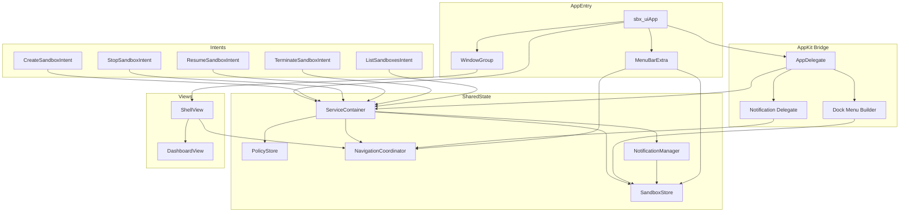
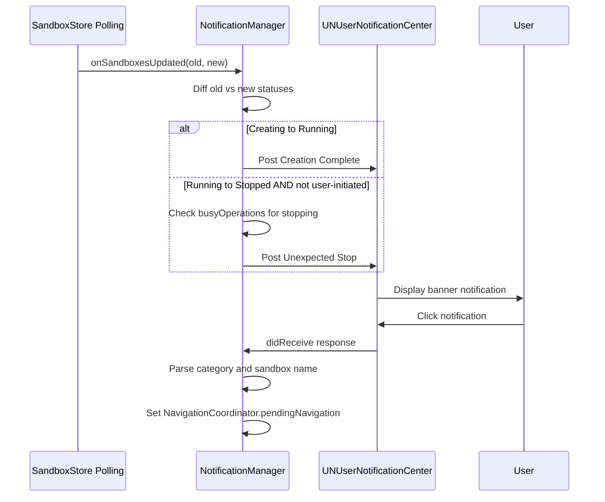
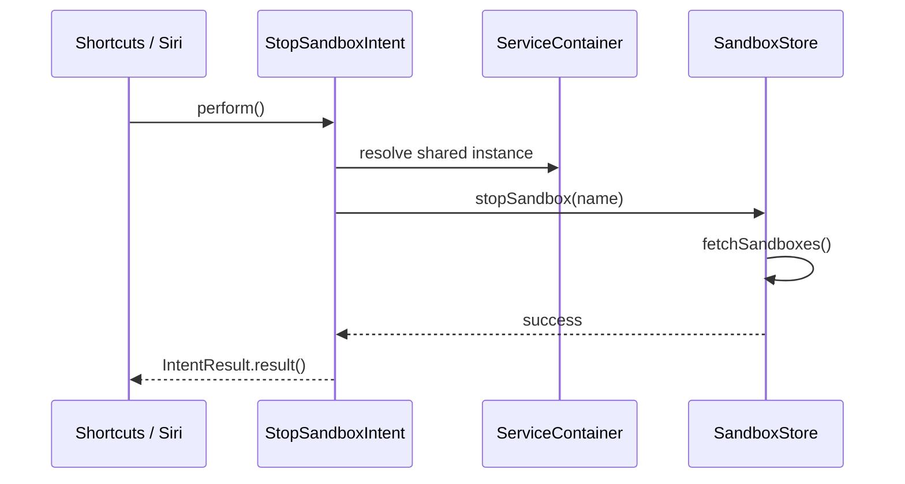

# Design Document

## Overview

**Purpose**: This feature delivers five macOS platform integrations — Menu Bar Extra, system notifications, drag & drop, dock menu, and App Intents — to sbx-ui users who manage Docker Sandbox lifecycles.

**Users**: Individual developers use sbx-ui alongside other macOS tools. These integrations let them monitor sandbox status, receive alerts, and trigger operations from the menu bar, dock, Finder, Shortcuts, and Siri — without switching to the main app window.

**Impact**: Modifies the App entry point to add new Scenes (MenuBarExtra) and an NSApplicationDelegateAdaptor. Introduces a ServiceContainer singleton to share state between the SwiftUI view hierarchy and external entry points (App Intents, dock menu, notifications). Adds a NavigationCoordinator for cross-feature deep linking.

### Goals
- Persistent system-level sandbox monitoring via menu bar icon with running count
- Proactive lifecycle alerts (creation complete, unexpected stop, policy violations, session disconnect)
- Frictionless sandbox creation by dropping folders from Finder
- Quick sandbox actions from the dock right-click menu
- Full Shortcuts/Siri automation for sandbox CRUD operations

### Non-Goals
- Touch Bar support (deprecated hardware)
- Global keyboard shortcuts (separate feature)
- Launch at Login / SMAppService (separate feature)
- Spotlight/CoreSpotlight indexing (separate feature)
- Menu bar icon customization or theming
- Notification sound/badge customization UI within the app

## Architecture

### Existing Architecture Analysis

The app follows a three-layer architecture: Service → Store → View.

- **Service layer**: `SbxServiceProtocol` (actor) wraps the `sbx` CLI. `ServiceFactory.create()` returns the concrete implementation.
- **Store layer**: `@MainActor @Observable` classes (`SandboxStore`, `PolicyStore`, `TerminalSessionStore`) hold state and call services. Created in `App.init()` and injected via `.environment()`.
- **View layer**: SwiftUI views read stores from the environment. Navigation state lives in `ShellView` as `@State` (`selection: SidebarDestination?`, `selectedSessionID: String?`).
- **Entry point**: Single `WindowGroup` scene. No `@NSApplicationDelegateAdaptor`.

Key constraint: Stores are `@MainActor`-isolated. Any new component accessing stores (AppDelegate, App Intents) must dispatch to MainActor.

### Architecture Pattern & Boundary Map

Selected pattern: **ServiceContainer singleton** — centralizes store instances so they are accessible from both the SwiftUI environment and external entry points (App Intents, AppDelegate).



**Architecture Integration**:
- Existing patterns preserved: Protocol-based services, @MainActor @Observable stores, environment injection for views
- New components: ServiceContainer (shared singleton), NavigationCoordinator (deep linking), NotificationManager (UNUserNotificationCenter wrapper), AppDelegate (dock menu + notification delegate)
- Domain boundaries: Each of the 5 features is a self-contained module (view/intent/delegate method) that interacts with shared state only through stores and coordinators

### Technology Stack

| Layer | Choice / Version | Role in Feature | Notes |
|-------|------------------|-----------------|-------|
| UI | SwiftUI MenuBarExtra (macOS 13+) | Menu bar popover scene | `.menuBarExtraStyle(.window)` |
| UI | SwiftUI onDrop / DropDelegate | Drag & drop on dashboard | UTType.fileURL |
| AppKit Bridge | @NSApplicationDelegateAdaptor | Dock menu + notification delegate | Single AppDelegate class |
| Notifications | UserNotifications (UNUserNotificationCenter) | Post and handle system notifications | macOS banner style default |
| Automation | App Intents (macOS 13+) | Shortcuts/Siri integration | AppIntent, AppEntity, AppShortcutsProvider |
| Types | UniformTypeIdentifiers | Drop validation | UTType.fileURL |

## System Flows

### Notification Lifecycle (State Diffing)



### App Intent Execution



## Requirements Traceability

| Requirement | Summary | Components | Interfaces | Flows |
|-------------|---------|------------|------------|-------|
| 1.1–1.3 | Menu bar icon with running count | MenuBarPopoverView, ServiceContainer | SandboxStore.sandboxes | — |
| 1.4–1.8 | Menu bar sandbox list and actions | MenuBarPopoverView | SandboxStore.stop/resume | — |
| 1.9–1.10 | Menu bar navigation and create | MenuBarPopoverView, NavigationCoordinator | NavigationCoordinator.navigate() | — |
| 1.11 | Quit action | MenuBarPopoverView | NSApplication.terminate | — |
| 1.12 | Shared polling data | ServiceContainer | SandboxStore (shared instance) | — |
| 2.1–2.4 | Notification posting for events | NotificationManager | NotificationManager.post() | Notification Lifecycle |
| 2.5–2.6 | Notification click navigation | AppDelegate (UNDelegate), NavigationCoordinator | NavigationCoordinator.navigate() | Notification Lifecycle |
| 2.7–2.8 | Notification authorization | NotificationManager | UNUserNotificationCenter.requestAuthorization | — |
| 2.9 | Notification categories | NotificationManager | UNNotificationCategory registration | — |
| 2.10 | Suppress user-initiated stop | NotificationManager | SandboxStore.busyOperations | Notification Lifecycle |
| 3.1, 3.5 | Drop zone overlay | DashboardView (onDrop modifier) | isTargeted binding | — |
| 3.2, 3.6 | Drop to create | DashboardView, DropZoneOverlay | CreateProjectSheet pre-fill | — |
| 3.3–3.4 | Drop validation | DashboardView (DropDelegate) | FileManager directory check | — |
| 3.7 | Drop existing workspace | DashboardView | NavigationCoordinator.navigate() | — |
| 4.1–4.2 | Dock menu sandbox list | AppDelegate, DockMenuBuilder | SandboxStore.sandboxes | — |
| 4.3–4.7 | Dock menu actions | AppDelegate, DockMenuBuilder | SandboxStore.stop/resume, NavigationCoordinator | — |
| 4.8–4.10 | Dock menu new sandbox and rebuild | AppDelegate, DockMenuBuilder | NavigationCoordinator.navigate() | — |
| 5.1–5.6 | Sandbox CRUD intents | CreateSandboxIntent, StopSandboxIntent, ResumeSandboxIntent, TerminateSandboxIntent, ListSandboxesIntent | ServiceContainer, SandboxStore | App Intent Execution |
| 5.7–5.8 | Intent error handling and idempotency | All intent structs | SbxServiceError mapping | — |
| 5.9 | Siri phrases | SbxShortcutsProvider | AppShortcutsProvider protocol | — |
| 5.10 | Intent parameter metadata | All intent structs | @Parameter annotations | — |
| 5.11 | Intent triggers refresh | All mutating intents | SandboxStore.fetchSandboxes() | App Intent Execution |
| 5.12 | Dynamic sandbox picker | SandboxEntity, SandboxEntityQuery | DynamicOptionsProvider, EntityQuery | — |

## Components and Interfaces

| Component | Domain/Layer | Intent | Req Coverage | Key Dependencies | Contracts |
|-----------|-------------|--------|--------------|------------------|-----------|
| ServiceContainer | Infrastructure | Shared singleton holding stores and services | All | SbxServiceProtocol (P0) | State |
| NavigationCoordinator | Infrastructure | Centralized deep-link navigation | 1.9, 1.10, 2.5, 2.6, 3.7, 4.7, 4.8 | — | State |
| NotificationManager | Service | Post and manage macOS notifications | 2.1–2.10 | UNUserNotificationCenter (P0), SandboxStore (P0) | Service, Event |
| AppDelegate | AppKit Bridge | Dock menu builder + notification delegate | 2.5, 2.6, 4.1–4.10 | ServiceContainer (P0) | Service |
| MenuBarPopoverView | UI | Menu bar popover with sandbox list | 1.1–1.12 | SandboxStore (P0), NavigationCoordinator (P1) | — |
| DropZoneOverlay | UI | Visual feedback for drag & drop | 3.1, 3.5 | — | — |
| DashboardView (modified) | UI | Adds onDrop handler and drop zone | 3.1–3.7 | SandboxStore (P0), NavigationCoordinator (P1) | — |
| SandboxEntity | App Intents | AppEntity representation of a sandbox | 5.12 | ServiceContainer (P0) | State |
| CreateSandboxIntent | App Intents | Shortcuts intent for creating sandboxes | 5.1, 5.6, 5.10, 5.11 | ServiceContainer (P0) | Service |
| StopSandboxIntent | App Intents | Shortcuts intent for stopping sandboxes | 5.2, 5.7, 5.10, 5.11 | ServiceContainer (P0) | Service |
| ResumeSandboxIntent | App Intents | Shortcuts intent for resuming sandboxes | 5.3, 5.8, 5.10, 5.11 | ServiceContainer (P0) | Service |
| TerminateSandboxIntent | App Intents | Shortcuts intent for terminating sandboxes | 5.4, 5.10, 5.11 | ServiceContainer (P0) | Service |
| ListSandboxesIntent | App Intents | Shortcuts intent for listing sandboxes | 5.5, 5.10 | ServiceContainer (P0) | Service |
| SbxShortcutsProvider | App Intents | Siri phrase registration | 5.9 | All intents (P0) | — |

### Infrastructure Layer

#### ServiceContainer

| Field | Detail |
|-------|--------|
| Intent | Shared singleton holding canonical instances of services and stores |
| Requirements | All (enables access from App Intents, AppDelegate, and SwiftUI) |

**Responsibilities & Constraints**
- Owns the single `SbxServiceProtocol` instance and all store instances
- Created once at app startup; accessed via `ServiceContainer.shared`
- Thread-safe: stores are `@MainActor`, container provides access to them

**Dependencies**
- External: SbxServiceProtocol — CLI executor (P0)

**Contracts**: State [x]

##### State Management
- State model: `shared` static property holding `service`, `sandboxStore`, `policyStore`, `sessionStore`, `navigationCoordinator`, `notificationManager`
- Persistence: In-memory only (stores are ephemeral, rebuilt on app launch)
- Concurrency: Container itself is `@MainActor`; all property access is MainActor-isolated

```swift
@MainActor
final class ServiceContainer {
    static let shared = ServiceContainer()

    let service: any SbxServiceProtocol
    let sandboxStore: SandboxStore
    let policyStore: PolicyStore
    let sessionStore: TerminalSessionStore
    let navigationCoordinator: NavigationCoordinator
    let notificationManager: NotificationManager
}
```

**Implementation Notes**
- Integration: `sbx_uiApp.init()` initializes `ServiceContainer.shared`, then reads stores from it for `@State` and `.environment()` injection
- Validation: ServiceFactory.create() is called once inside the container
- Risks: Singleton introduces global state; mitigated by protocol-based service for testing

#### NavigationCoordinator

| Field | Detail |
|-------|--------|
| Intent | Centralized deep-link handler for cross-feature navigation requests |
| Requirements | 1.9, 1.10, 2.5, 2.6, 3.7, 4.7, 4.8 |

**Responsibilities & Constraints**
- Receives navigation requests from menu bar, dock menu, notifications, and intents
- Publishes a `pendingNavigation` that ShellView observes and executes
- Manages window activation (bring main window to front)

**Contracts**: State [x]

##### State Management

```swift
enum NavigationRequest: Equatable {
    case sandbox(name: String)           // open sandbox session
    case policyLog(sandboxName: String)  // open policy log filtered to sandbox
    case createSheet                     // open create sandbox sheet
    case createWithWorkspace(path: String) // open create sheet with workspace pre-filled
}

@MainActor @Observable
final class NavigationCoordinator {
    var pendingNavigation: NavigationRequest?

    func navigate(to request: NavigationRequest)
    func activateMainWindow()
    func consumeNavigation() -> NavigationRequest?
}
```

- `navigate(to:)` sets `pendingNavigation` and calls `activateMainWindow()`
- `activateMainWindow()` uses `NSApplication.shared.activate()` and orders front the key window
- ShellView calls `consumeNavigation()` in an `.onChange(of:)` to handle the request and clear it

### Service Layer

#### NotificationManager

| Field | Detail |
|-------|--------|
| Intent | Wraps UNUserNotificationCenter for posting and managing sandbox lifecycle notifications |
| Requirements | 2.1–2.10 |

**Responsibilities & Constraints**
- Requests notification authorization on initialization
- Posts notifications for lifecycle transitions, policy violations, session disconnects
- Defines notification categories with action buttons
- Checks `SandboxStore.busyOperations` before posting "unexpected stop" to suppress user-initiated stops
- Tracks previously seen sandbox states to detect transitions

**Dependencies**
- External: UNUserNotificationCenter (P0)
- Inbound: SandboxStore — provides sandbox state and busyOperations (P0)
- Outbound: NavigationCoordinator — receives navigation requests from notification clicks (P1)

**Contracts**: Service [x] / Event [x]

##### Service Interface

```swift
@MainActor @Observable
final class NotificationManager {
    private(set) var isAuthorized: Bool

    func requestAuthorization() async
    func onSandboxesUpdated(previous: [Sandbox], current: [Sandbox], busyOperations: [String: SandboxOperation])
    func postPolicyViolation(sandboxName: String, blockedHost: String)
    func postSessionDisconnected(sandboxName: String)
}
```

- Preconditions: `requestAuthorization()` called before any posting
- Postconditions: Notification posted only if `isAuthorized == true`
- Invariants: User-initiated stops (busyOperations contains `.stopping`) never trigger "unexpected stop" notifications

##### Event Contract
- Published events: UNNotification posts with categories `sandbox-lifecycle`, `policy-violation`, `session-event`
- Subscribed events: UNUserNotificationCenterDelegate `didReceive` response (handled by AppDelegate, forwarded to NavigationCoordinator)

##### Notification Categories

| Category ID | Actions | Thread Grouping |
|-------------|---------|-----------------|
| `sandbox-lifecycle` | "Open" (foreground) | `sandbox-{name}` |
| `policy-violation` | "View Log" (foreground) | `policy-{sandboxName}` |
| `session-event` | "Reconnect" (foreground) | `session-{sandboxName}` |

**Implementation Notes**
- Integration: Called from SandboxStore's `fetchSandboxes()` (pass old/new state to `onSandboxesUpdated`)
- Validation: Only posts if authorization granted and category matches a known transition
- Risks: macOS defaults to banner (not alert) — notifications may be missed. No mitigation within app; user must configure in System Settings.

### AppKit Bridge Layer

#### AppDelegate

| Field | Detail |
|-------|--------|
| Intent | NSApplicationDelegate providing dock menu and notification delegate |
| Requirements | 2.5, 2.6, 4.1–4.10 |

**Responsibilities & Constraints**
- Implements `applicationDockMenu(_:)` — builds NSMenu from current SandboxStore state on each invocation
- Conforms to `UNUserNotificationCenterDelegate` — handles notification click responses
- Accesses stores via `ServiceContainer.shared`
- Sets itself as UNUserNotificationCenter delegate in `applicationDidFinishLaunching`

**Dependencies**
- Inbound: NSApplication — dock menu callback, launch callback (P0)
- Inbound: UNUserNotificationCenter — notification response callback (P0)
- Outbound: ServiceContainer — store access (P0)
- Outbound: NavigationCoordinator — deep link execution (P1)

**Contracts**: Service [x]

##### Service Interface

```swift
class AppDelegate: NSObject, NSApplicationDelegate, UNUserNotificationCenterDelegate {
    func applicationDockMenu(_ sender: NSApplication) -> NSMenu?
    func applicationDidFinishLaunching(_ notification: Notification)
    func userNotificationCenter(_: UNUserNotificationCenter,
                                didReceive response: UNNotificationResponse,
                                withCompletionHandler: @escaping () -> Void)
}
```

##### Dock Menu Construction

`applicationDockMenu(_:)` rebuilds the menu each invocation:
1. "New Sandbox…" item at top
2. Separator
3. Running sandboxes (submenu: Stop, Open)
4. Stopped sandboxes (submenu: Resume, Open)

Action selectors dispatch to MainActor and call `SandboxStore.stopSandbox/resumeSandbox` or `NavigationCoordinator.navigate(to:)`.

**Implementation Notes**
- Integration: Registered via `@NSApplicationDelegateAdaptor(AppDelegate.self)` on App struct
- Risks: Dock menu not visible in Xcode debugger — manual testing required outside IDE

### UI Layer

#### MenuBarPopoverView

| Field | Detail |
|-------|--------|
| Intent | SwiftUI view inside MenuBarExtra displaying sandbox list with status and quick actions |
| Requirements | 1.1–1.12 |

**Responsibilities & Constraints**
- Renders as a `.window`-style MenuBarExtra popover
- Reads `SandboxStore.sandboxes` for list content
- Groups by status (running first, then stopped)
- Provides Stop/Resume/Open in App actions per sandbox
- Includes "New Sandbox…" and "Quit" actions

**Dependencies**
- Inbound: SandboxStore — sandbox list and operations (P0)
- Outbound: NavigationCoordinator — "Open in App" navigation (P1)

**Contracts**: — (presentation only)

**Implementation Notes**
- Menu bar icon: Use SF Symbol `"shippingbox"` (matches sandbox metaphor). Running count displayed via label text: `MenuBarExtra("sbx (\(runningCount))", systemImage: "shippingbox.fill")` when running, `MenuBarExtra("sbx", systemImage: "shippingbox")` when idle.
- The popover shares stores via `.environment()` injection in the App body, identical to WindowGroup.

#### DropZoneOverlay

| Field | Detail |
|-------|--------|
| Intent | Visual overlay indicating a valid drop target on the dashboard |
| Requirements | 3.1, 3.5 |

Summary-only component. Renders a dashed border + "Drop to create sandbox" label when `isTargeted` is true. Follows design system colors (accent border, surface background with opacity).

#### DashboardView Modifications

| Field | Detail |
|-------|--------|
| Intent | Add `.onDrop` modifier and DropZoneOverlay to existing DashboardView |
| Requirements | 3.1–3.7 |

**Implementation Notes**
- Add `@State private var isDropTargeted = false` to DashboardView
- Add `.onDrop(of: [.fileURL], isTargeted: $isDropTargeted)` with handler that validates directory and either opens CreateProjectSheet or navigates to existing sandbox
- Overlay `DropZoneOverlay(isVisible: isDropTargeted)` on the ScrollView
- Validation: Check `url.hasDirectoryPath`; if false, return `false` from handler. If multiple items, use first.
- Dedup: Compare dropped path against `sandboxStore.sandboxes.map(\.workspace)` — if match found and sandbox is running, use NavigationCoordinator.

### App Intents Layer

#### SandboxEntity

| Field | Detail |
|-------|--------|
| Intent | AppEntity representing a sandbox for dynamic parameter resolution in Shortcuts |
| Requirements | 5.12 |

**Contracts**: State [x]

```swift
struct SandboxEntity: AppEntity {
    static var typeDisplayRepresentation: TypeDisplayRepresentation
    static var defaultQuery: SandboxEntityQuery

    var id: String       // sandbox name
    var name: String
    var status: String

    var displayRepresentation: DisplayRepresentation
}

struct SandboxEntityQuery: EntityQuery {
    func entities(for identifiers: [String]) async throws -> [SandboxEntity]
    func suggestedEntities() async throws -> [SandboxEntity]
}
```

- `suggestedEntities()` returns all sandboxes from `ServiceContainer.shared.sandboxStore`
- `entities(for:)` filters by name match

#### Intent Structs (CreateSandboxIntent, StopSandboxIntent, ResumeSandboxIntent, TerminateSandboxIntent, ListSandboxesIntent)

| Field | Detail |
|-------|--------|
| Intent | Individual AppIntent conformances for each sandbox operation |
| Requirements | 5.1–5.11 |

**Contracts**: Service [x]

##### CreateSandboxIntent

```swift
struct CreateSandboxIntent: AppIntent {
    static var title: LocalizedStringResource = "Create Sandbox"

    @Parameter(title: "Workspace Path")
    var workspacePath: String

    @Parameter(title: "Name", default: nil)
    var name: String?

    @MainActor
    func perform() async throws -> some IntentResult & ReturnsValue<String>
}
```

- Returns sandbox name as string result
- Calls `ServiceContainer.shared.sandboxStore.createSandbox(workspace:name:)`

##### StopSandboxIntent

```swift
struct StopSandboxIntent: AppIntent {
    static var title: LocalizedStringResource = "Stop Sandbox"

    @Parameter(title: "Sandbox")
    var sandbox: SandboxEntity

    @MainActor
    func perform() async throws -> some IntentResult
}
```

- If sandbox not found, throws intent error with descriptive message
- Other mutating intents (Resume, Terminate) follow the same pattern

##### ListSandboxesIntent

```swift
struct ListSandboxesIntent: AppIntent {
    static var title: LocalizedStringResource = "List Sandboxes"

    @MainActor
    func perform() async throws -> some IntentResult & ReturnsValue<[String]>
}
```

- Returns array of `"name (status)"` strings
- Calls `ServiceContainer.shared.sandboxStore.fetchSandboxes()` then maps

#### SbxShortcutsProvider

| Field | Detail |
|-------|--------|
| Intent | Registers Siri phrases for all intents |
| Requirements | 5.9 |

```swift
struct SbxShortcutsProvider: AppShortcutsProvider {
    static var appShortcuts: [AppShortcut] {
        AppShortcut(intent: CreateSandboxIntent(), phrases: ["Create a sandbox in \(.applicationName)"])
        AppShortcut(intent: StopSandboxIntent(), phrases: ["Stop sandbox in \(.applicationName)"])
        AppShortcut(intent: ListSandboxesIntent(), phrases: ["List my sandboxes in \(.applicationName)"])
    }
}
```

**Implementation Notes**
- Maximum 10 shortcuts allowed by the framework
- All mutating intents call `sandboxStore.fetchSandboxes()` after the operation to ensure UI reflects the change
- Intents use `@MainActor` on `perform()` for direct store access

## Data Models

### Domain Model

No new persistent data models. All five features consume existing domain types (`Sandbox`, `SandboxStatus`, `PolicyLogEntry`).

New transient types:
- `NavigationRequest` — enum representing a deep-link target (see NavigationCoordinator)
- `SandboxEntity` — AppEntity wrapper around `Sandbox` for the Intents framework (see App Intents Layer)
- Notification category identifiers — string constants (`sandbox-lifecycle`, `policy-violation`, `session-event`)

## Error Handling

### Error Strategy

| Error Source | Error Type | Response |
|-------------|-----------|----------|
| Notification authorization denied | User permission | Silently disable notifications; no error surfaced |
| Intent sandbox not found | Business logic | Return `IntentError` with localized message |
| Intent operation fails | CLI/service error | Map `SbxServiceError` to `IntentError` with user-facing description |
| Drop non-directory file | User input | Ignore drop silently (return `false`) |
| Dock menu action fails | CLI/service error | Log error via appLog; show toast if main window visible |
| Menu bar action fails | CLI/service error | Display inline error state in popover |

### Error Categories and Responses

**User Errors**: Invalid drop target (non-directory) → silently ignored. Invalid intent parameters → `IntentError` with guidance.
**System Errors**: CLI failures during intent/dock/menu bar actions → graceful degradation with logging. Notification delivery failure → no user-facing error (macOS handles delivery).
**Business Logic Errors**: Sandbox not found, already running → descriptive error messages in intent results and toast notifications.

## Testing Strategy

### Unit Tests
- `ServiceContainer` initialization and shared instance access
- `NavigationCoordinator` — setting and consuming pending navigation
- `NotificationManager.onSandboxesUpdated` — verify correct notifications posted for each transition type; verify user-initiated stop suppression
- `DockMenuBuilder` — verify menu structure matches sandbox state (running first, stopped second, "New Sandbox…" always present)
- All 5 App Intent `perform()` methods — verify correct store method called, correct return value, correct error mapping

### UI/E2E Tests
- Menu bar popover: verify sandbox list displays, Stop/Resume actions work, "Open in App" navigates correctly
- Drag & drop: verify drop zone appears on drag hover, dropping a directory opens create sheet with path pre-filled, dropping a file is ignored
- Dock menu: manual testing only (not visible in Xcode debugger)
- App Intents: test via Shortcuts app or `xcrun shortcuts` CLI

### Integration Tests
- Notification flow: create sandbox via store → verify notification posted → simulate click → verify NavigationCoordinator receives correct request
- Intent → Store round-trip: invoke intent → verify store state updated → verify sandbox list refreshed
