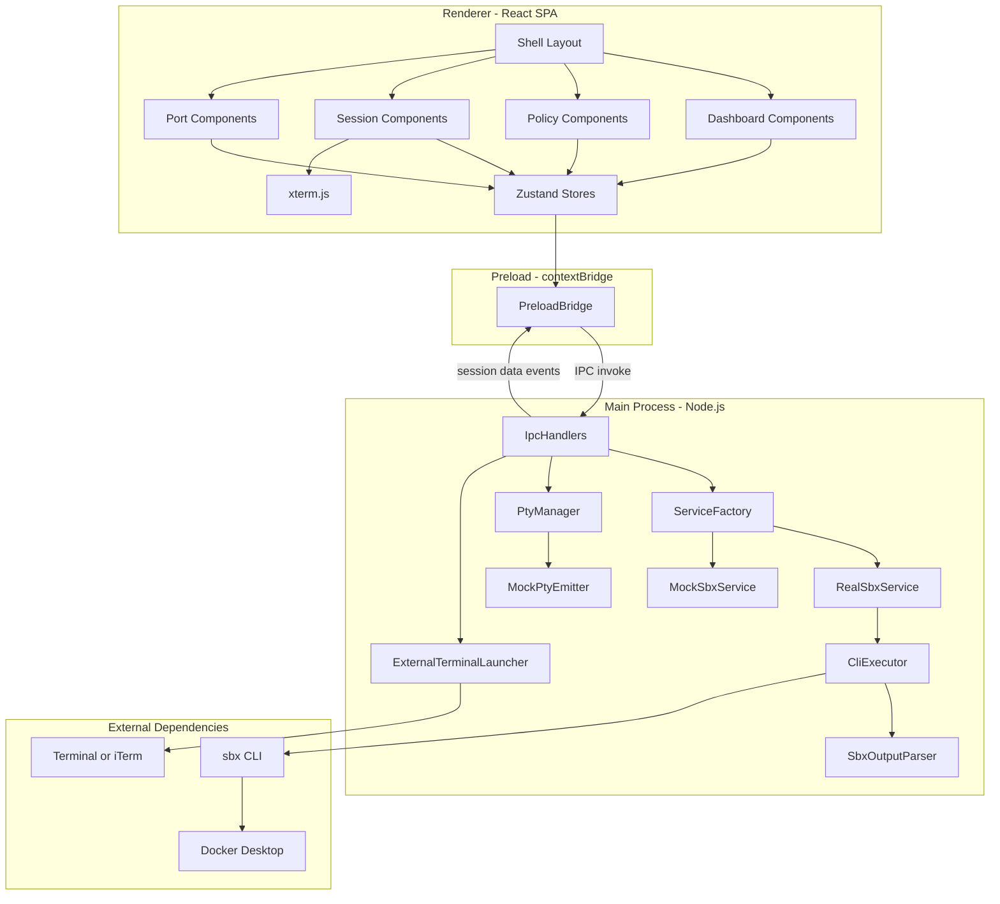
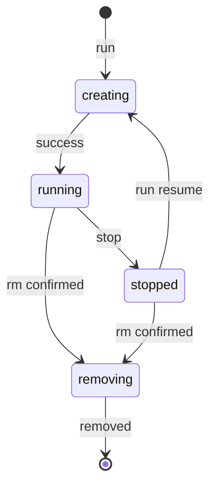
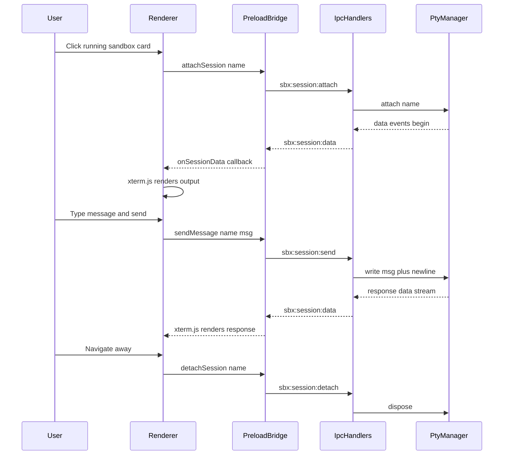
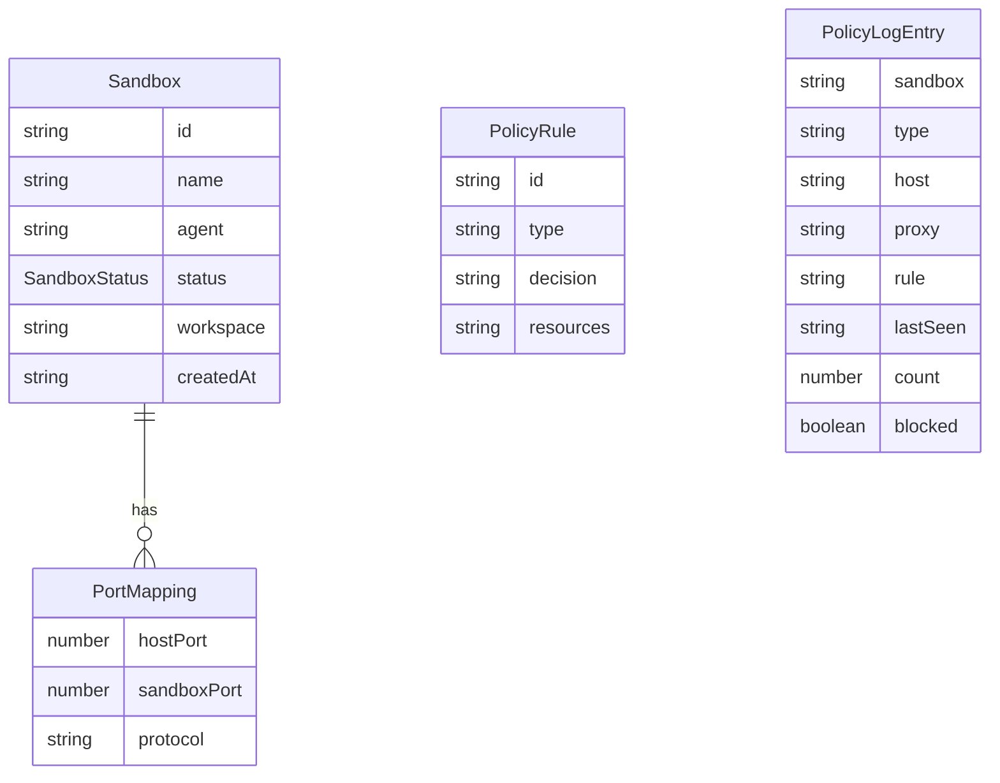

# Design Document

## Overview

**Purpose**: sbx-ui delivers a desktop GUI that wraps the Docker Sandbox (`sbx`) CLI, enabling developers to manage sandbox lifecycles, network policies, port forwarding, and Claude Code agent sessions without terminal interaction.

**Users**: Individual developers and small teams using Docker Sandbox for AI-assisted coding. Primary workflow: create a project from a local Git repo, launch Claude Code, interact via chat-style UI, manage security policies, and inspect sandbox state — all from a single application window.

**Impact**: Introduces a new Electron application. No existing systems are modified. The app wraps the `sbx` CLI as an external dependency and can operate entirely against an in-memory mock for development and testing.

### Goals
- Provide a visual interface for all Phase 1 `sbx` CLI operations (lifecycle, policies, ports, sessions)
- Enable chat-style interaction with Claude Code sessions running inside sandboxes
- Deliver a full in-memory mock layer enabling E2E testing without Docker Desktop
- Follow "The Technical Monolith" design system for a premium developer-tool aesthetic
- Support opening bash shells in external terminal applications (Terminal.app, iTerm)

### Non-Goals
- Branch mode and Git worktree management (Phase 2)
- Multi-agent support beyond Claude Code (Phase 2)
- IDE integration — VSCode, Xcode, IntelliJ (Phase 2)
- Template customization UI (Phase 2)
- Notification center and file embedding in chat (Phase 2)
- Shared workspaces across agents (Phase 2)
- Organization-level governance UI (Phase 2)
- Windows and Linux support (Phase 2)

## Architecture

> Detailed discovery findings are in `research.md`. All architectural decisions are captured here.

### Architecture Pattern & Boundary Map

**Selected pattern**: Layered architecture following Electron's native Main/Preload/Renderer process boundary. The `SbxService` interface acts as the primary ports-and-adapters boundary between the application and the `sbx` CLI, enabling transparent mock/real implementation swapping.

**Domain boundaries**:
- **Main Process**: Owns all system I/O — CLI spawning, PTY management, filesystem dialogs, external terminal launching. No UI logic.
- **Preload**: Thin typed bridge. Maps IPC channels to the `window.sbx` API. No business logic.
- **Renderer**: Owns all UI state and presentation. Communicates exclusively through `window.sbx`. No direct Node.js or Electron main-process access.

**Existing patterns preserved**: N/A (greenfield project)

**New components rationale**: All components are new. The SbxService interface is the foundational abstraction enabling mock-driven development and E2E testing.

**Steering compliance**: Follows `tech.md` stack choices (Electron 36+, React 19, Zustand, xterm.js, node-pty, electron-vite). Follows `structure.md` directory organization (layer-first, domain-grouped components, one store per domain).



### Technology Stack

| Layer | Choice / Version | Role in Feature | Notes |
|-------|------------------|-----------------|-------|
| Frontend | React 19 + TypeScript strict | SPA UI, component rendering, hooks | Domain-grouped components |
| Styling | Tailwind CSS 4 | Design system implementation | "The Technical Monolith" tokens |
| State | Zustand | Sandbox, policy, session stores | One store per domain |
| Terminal Rendering | xterm.js 5 | ANSI terminal output in renderer | Addons: fit, weblinks |
| PTY | node-pty | Pseudo-terminal spawning in main | One PTY per attached session |
| Shell | Electron 36+ | Desktop framework, IPC, native dialogs | contextBridge for security |
| IPC | Electron contextBridge | Typed window.sbx API | Preload script only |
| Build | electron-vite | Dev server with HMR, production bundling | ESM-native, single config |
| Package Manager | pnpm | Dependency management | min-release-age=14d for supply-chain hardening |
| Package | electron-builder | macOS DMG distribution | Signed if certs available |
| Unit Testing | Vitest | Service, parser, store tests | Fast, ESM-native |
| E2E Testing | Playwright with Electron | Full UI flow testing against mock | SBX_MOCK=1 forced |

## System Flows

### Sandbox Lifecycle State Machine



**Key decisions**:
- `creating` and `removing` are transient states during which UI controls are disabled (2.5)
- Port mappings are cleared on transition to `stopped`, matching real `sbx` behavior (5.7)
- Resuming a stopped sandbox calls `run` with the sandbox name, not workspace path (3.3)
- Duplicate workspace detection returns existing sandbox instead of creating a new one (1.5)

### Session Interaction Flow



**Key decisions**:
- `attachSession` spawns a PTY (real: `node-pty` running `sbx run <name>`, mock: `MockPtyEmitter`)
- `sendMessage` writes text + newline to PTY stdin, simulating terminal input (6.3)
- Session auto-reattaches when a stopped sandbox resumes if the session panel is open (6.5)
- Only one session active at a time per current UI design

## Requirements Traceability

| Requirement | Summary | Components | Interfaces | Flows |
|-------------|---------|------------|------------|-------|
| 1.1 | Directory picker on deploy button | CreateProjectDialog | selectDirectory | — |
| 1.2 | Create sandbox from selected directory | CreateProjectDialog, SandboxStore | SbxService.run | Lifecycle |
| 1.3 | Auto-generate sandbox name | SbxService.run, MockSbxService | RunOptions | — |
| 1.4 | Cancel picker without side effects | CreateProjectDialog | selectDirectory | — |
| 1.5 | Return existing for duplicate workspace | SbxService.run, MockSbxService | SbxService.run | — |
| 2.1 | Grid layout of sandbox cards | SandboxGrid, SandboxCard | SandboxStoreState | — |
| 2.2 | Card shows name, agent, status, workspace | SandboxCard | Sandbox type | — |
| 2.3 | Green LED pulse for running | StatusChip | SandboxStatus | — |
| 2.4 | STOPPED chip without animation | StatusChip | SandboxStatus | — |
| 2.5 | Spinner and disabled during transitions | SandboxCard, StatusChip | SandboxStatus | — |
| 2.6 | Global stats bar | GlobalStats | SandboxStoreState | — |
| 2.7 | Poll sandbox list every 3s | SandboxStore | SbxService.list | — |
| 3.1 | Launch sandbox | SandboxStore, SandboxCard | SbxService.run | Lifecycle |
| 3.2 | Stop running sandbox | SandboxStore, SandboxCard | SbxService.stop | Lifecycle |
| 3.3 | Resume stopped sandbox | SandboxStore, SandboxCard | SbxService.run | Lifecycle |
| 3.4 | Confirmation before termination | SandboxCard | — | — |
| 3.5 | Remove after confirmation | SandboxStore | SbxService.rm | Lifecycle |
| 3.6 | Cancel termination does nothing | SandboxCard | — | — |
| 4.1 | Policy panel listing rules | PolicyPanel, PolicyRuleRow | PolicyStoreState | — |
| 4.2 | Pre-seeded Balanced defaults | MockSbxService, RealSbxService | SbxService.policyList | — |
| 4.3 | Allow policy submission | AddPolicyDialog, PolicyStore | SbxService.policyAllow | — |
| 4.4 | Deny policy submission | AddPolicyDialog, PolicyStore | SbxService.policyDeny | — |
| 4.5 | Remove policy rule | PolicyRuleRow, PolicyStore | SbxService.policyRemove | — |
| 4.6 | Network activity log table | PolicyLogViewer | SbxService.policyLog | — |
| 4.7 | Log filtering by sandbox and blocked | PolicyLogViewer | PolicyStoreState | — |
| 5.1 | Port panel per sandbox | PortPanel, PortMappingRow | SbxService.portsList | — |
| 5.2 | Publish port mapping | AddPortDialog, PortPanel | SbxService.portsPublish | — |
| 5.3 | Unpublish port mapping | PortMappingRow | SbxService.portsUnpublish | — |
| 5.4 | Port chips on sandbox card | SandboxCard | Sandbox.ports | — |
| 5.5 | Reject duplicate host port | SbxService.portsPublish | SbxServiceError | — |
| 5.6 | Disable port publish when stopped | PortPanel | SandboxStatus | — |
| 5.7 | Clear ports on stop | MockSbxService, SandboxStore | SbxService.stop | Lifecycle |
| 6.1 | Session panel with split layout | SessionPanel | SessionStoreState | Session |
| 6.2 | xterm.js with ANSI support | MiniTerminal | onSessionData | Session |
| 6.3 | Send message to PTY stdin | ChatInput, SessionStore | SbxService.sendMessage | Session |
| 6.4 | Agent status bar | AgentStatusBar | Sandbox type | — |
| 6.5 | Auto-reattach on resume | SessionStore | SbxService.attach | Session |
| 6.6 | Detach on navigate away | SessionStore | SbxService.detachSession | Session |
| 7.1 | Mock mode via SBX_MOCK env | ServiceFactory | — | — |
| 7.2 | MockSbxService implements full interface | MockSbxService | SbxService | — |
| 7.3 | Realistic lifecycle delays | MockSbxService | — | Lifecycle |
| 7.4 | Pre-seeded Balanced defaults | MockSbxService | — | — |
| 7.5 | Simulated terminal output | MockPtyEmitter | PtyHandle | Session |
| 7.6 | Simulated agent response sequence | MockPtyEmitter | PtyHandle | Session |
| 7.7 | Same validation rules as real | MockSbxService | SbxService | — |
| 8.1 | Shell with sidebar, topbar, content | Shell, Sidebar, TopBar | — | — |
| 8.2 | Sidebar nav for dashboard and policies | Sidebar | — | — |
| 8.3 | Dark surface hierarchy design system | All UI components | Tailwind config | — |
| 8.4 | Font stack Inter, JetBrains Mono, Space Grotesk | All UI components | Tailwind config | — |
| 8.5 | Max border-radius 0.5rem | All UI components | Tailwind config | — |
| 9.1 | contextBridge exposure only | PreloadBridge | SbxPreloadApi | — |
| 9.2 | Typed window.sbx API | PreloadBridge | SbxPreloadApi | — |
| 9.3 | CLI and PTY in main process only | IpcHandlers, PtyManager | — | — |
| 9.4 | Error state for missing sbx or Docker | RealSbxService, Shell | SbxServiceError | — |
| 9.5 | Error toast for CLI failures | Shell, SandboxStore | SbxServiceError | — |
| 10.1 | E2E coverage for all Phase 1 features | E2E test specs | — | All |
| 10.2 | Run against MockSbxService | E2E setup | ServiceFactory | — |
| 10.3 | Lifecycle status transition test | sandbox-lifecycle.spec | — | Lifecycle |
| 10.4 | Policy CRUD test | policy-management.spec | — | — |
| 10.5 | Port forwarding CRUD test | port-forwarding.spec | — | — |
| 10.6 | Session messaging test | session-messaging.spec | — | Session |
| 11.1 | Open bash shell in external terminal | ExternalTerminalLauncher | ExternalTerminalApi | — |
| 11.2 | Support Terminal.app and iTerm | ExternalTerminalLauncher | TerminalApp type | — |
| 11.3 | Detect installed terminals | ExternalTerminalLauncher | detectAvailable | — |
| 11.4 | Default to Terminal.app | ExternalTerminalLauncher | TerminalApp type | — |
| 11.5 | Setting for preferred terminal | SettingsStore | UserPreferences | — |
| 11.6 | Error on terminal launch failure | ExternalTerminalLauncher | SbxServiceError | — |
| 11.7 | Disable shell when stopped | SandboxCard | SandboxStatus | — |

## Components and Interfaces

| Component | Domain | Intent | Req Coverage | Key Dependencies | Contracts |
|-----------|--------|--------|--------------|------------------|-----------|
| SbxService | Main / Services | Central contract for all sbx operations | All | — | Service |
| RealSbxService | Main / Services | Wraps sbx CLI via process spawning | All runtime | CliExecutor P0, SbxOutputParser P0 | Service |
| MockSbxService | Main / Services | In-memory simulation for dev and E2E | 7.1–7.7 | — | Service, State |
| ServiceFactory | Main / Services | Selects real or mock by env var | 7.1 | SbxService P0 | Service |
| PtyManager | Main / PTY | Manages PTY sessions per sandbox | 6.1–6.6 | node-pty P0, MockPtyEmitter P1 | Service |
| MockPtyEmitter | Main / PTY | Simulates Claude Code terminal output | 7.5, 7.6 | — | Event |
| CliExecutor | Main / Utils | Spawns sbx CLI and captures output | All runtime | child_process P0 | Service |
| SbxOutputParser | Main / Utils | Parses column-delimited CLI stdout | All runtime | — | Service |
| IpcHandlers | Main | Registers IPC handlers bridging to services | 9.1–9.3 | SbxService P0, PtyManager P0 | Service |
| ExternalTerminalLauncher | Main | Opens bash shells in external terminals | 11.1–11.6 | osascript P0 | Service |
| PreloadBridge | Preload | Exposes typed window.sbx via contextBridge | 9.1, 9.2 | Electron IPC P0 | API |
| SandboxStore | Renderer / Stores | Sandbox list state with polling | 2.1–2.7, 3.1–3.6 | PreloadBridge P0 | State |
| PolicyStore | Renderer / Stores | Policy rules and log state | 4.1–4.7 | PreloadBridge P0 | State |
| SessionStore | Renderer / Stores | Active session state and PTY relay | 6.1–6.6 | PreloadBridge P0 | State |
| SettingsStore | Renderer / Stores | User preferences persistence | 11.5 | localStorage P0 | State |
| Shell | Renderer / Layout | App shell with sidebar, topbar, content | 8.1–8.5 | — | — |
| SandboxGrid | Renderer / Dashboard | Card grid rendering all sandboxes | 2.1 | SandboxStore P0 | — |
| SandboxCard | Renderer / Dashboard | Sandbox card with status and actions | 2.2–2.5, 3.1–3.6, 5.4, 11.7 | SandboxStore P0 | — |
| StatusChip | Renderer / Dashboard | LIVE pulse or STOPPED indicator | 2.3, 2.4, 2.5 | — | — |
| CreateProjectDialog | Renderer / Dashboard | Directory picker and name input | 1.1–1.5 | PreloadBridge P0 | — |
| GlobalStats | Renderer / Dashboard | Running and total sandbox counts | 2.6 | SandboxStore P0 | — |
| PolicyPanel | Renderer / Policies | Policy rule list with add and remove | 4.1–4.5 | PolicyStore P0 | — |
| AddPolicyDialog | Renderer / Policies | Domain input with allow and deny toggle | 4.3, 4.4 | PolicyStore P0 | — |
| PolicyLogViewer | Renderer / Policies | Activity log with filtering | 4.6, 4.7 | PolicyStore P0 | — |
| PortPanel | Renderer / Ports | Per-sandbox port mapping list | 5.1–5.3, 5.6 | SandboxStore P0 | — |
| AddPortDialog | Renderer / Ports | Port input with validation | 5.2, 5.5 | — | — |
| SessionPanel | Renderer / Session | Split layout with terminal and chat | 6.1 | SessionStore P0 | — |
| ChatInput | Renderer / Session | Message composer with send action | 6.3 | SessionStore P0 | — |
| MiniTerminal | Renderer / Session | xterm.js terminal embed | 6.2 | xterm.js P0 | — |
| AgentStatusBar | Renderer / Session | Model, sandbox, uptime, connection | 6.4 | SessionStore P0 | — |

### Main Process Layer

#### SbxService Interface

| Field | Detail |
|-------|--------|
| Intent | Central contract defining all sbx operations; implemented by real and mock |
| Requirements | All |

**Responsibilities & Constraints**
- Defines the compile-time contract between real CLI integration and in-memory mock
- All methods are async (return Promises) except PTY-related operations which manage event streams
- Implementations throw `SbxServiceError` for operation failures

**Contracts**: Service [x]

##### Service Interface
```typescript
type SandboxStatus = "running" | "stopped" | "creating" | "removing";

interface Sandbox {
  id: string;
  name: string;
  agent: "claude";
  status: SandboxStatus;
  workspace: string;
  ports: PortMapping[];
  createdAt: string;
}

interface PolicyRule {
  id: string;
  type: "network";
  decision: "allow" | "deny";
  resources: string;
}

interface PolicyLogEntry {
  sandbox: string;
  type: "network";
  host: string;
  proxy: "forward" | "transparent" | "network";
  rule: string;
  lastSeen: string;
  count: number;
  blocked: boolean;
}

interface PortMapping {
  hostPort: number;
  sandboxPort: number;
  protocol: "tcp";
}

interface RunOptions {
  name?: string;
  prompt?: string;
}

interface PtyHandle {
  onData(callback: (data: string) => void): void;
  write(data: string): void;
  dispose(): void;
}

interface SbxServiceError {
  code: "NOT_FOUND" | "ALREADY_EXISTS" | "PORT_CONFLICT"
      | "NOT_RUNNING" | "CLI_ERROR" | "DOCKER_NOT_RUNNING"
      | "INVALID_NAME";
  message: string;
  details?: string;
}

interface SbxService {
  // Lifecycle
  list(): Promise<Sandbox[]>;
  run(agent: "claude", workspace: string, opts?: RunOptions): Promise<Sandbox>;
  stop(name: string): Promise<void>;
  rm(name: string): Promise<void>;

  // Network policies
  policyList(): Promise<PolicyRule[]>;
  policyAllow(resources: string): Promise<PolicyRule>;
  policyDeny(resources: string): Promise<PolicyRule>;
  policyRemove(resource: string): Promise<void>;
  policyLog(sandboxName?: string): Promise<PolicyLogEntry[]>;

  // Port forwarding
  portsList(name: string): Promise<PortMapping[]>;
  portsPublish(name: string, hostPort: number, sbxPort: number): Promise<PortMapping>;
  portsUnpublish(name: string, hostPort: number, sbxPort: number): Promise<void>;

  // Session
  attach(name: string): PtyHandle;
  sendMessage(name: string, message: string): Promise<void>;
  detachSession(name: string): void;
}
```

- Preconditions: Sandbox must exist for stop, rm, ports, attach, sendMessage. Sandbox must be running for attach, sendMessage, portsPublish. Sandbox names must match `/^[a-z0-9][a-z0-9-]*$/` (lowercase alphanumeric and hyphens, no leading hyphen); `run` throws `INVALID_NAME` otherwise.
- Postconditions: `run` returns sandbox transitioning from "creating" to "running". `stop` clears port mappings. `rm` removes all associated data.
- Invariants: No two sandboxes share the same name. No two port mappings share the same host port across all sandboxes.

#### RealSbxService

| Field | Detail |
|-------|--------|
| Intent | Implements SbxService by spawning sbx CLI commands and parsing stdout |
| Requirements | All runtime operations |

**Responsibilities & Constraints**
- Spawns `sbx` CLI via CliExecutor for each operation
- Delegates stdout parsing to SbxOutputParser
- Detects missing `sbx` CLI or Docker Desktop and throws `SbxServiceError` with code `CLI_ERROR` or `DOCKER_NOT_RUNNING`

**Dependencies**
- Outbound: CliExecutor — spawns processes (P0)
- Outbound: SbxOutputParser — parses CLI output (P0)
- External: sbx CLI — must be installed and on PATH (P0)

**Contracts**: Service [x]

**Implementation Notes**
- Integration: CLI commands mapped per method — `list` → `sbx ls`, `run` → `sbx run claude <workspace> --name <name>`, `stop` → `sbx stop <name>`, `rm` → `sbx rm <name>`, policy and ports methods map to respective `sbx policy` and `sbx ports` subcommands
- Validation: Validates `sbx` availability on construction; surfaces meaningful error for missing CLI
- Risks: CLI output format changes could break parsing; mitigated by parser unit tests and `--json` where available

#### MockSbxService

| Field | Detail |
|-------|--------|
| Intent | In-memory SbxService implementation for development and E2E testing |
| Requirements | 7.1, 7.2, 7.3, 7.4, 7.5, 7.6, 7.7 |

**Responsibilities & Constraints**
- Maintains in-memory Maps for sandboxes, policies, port mappings
- Pre-seeds Balanced network policy defaults on construction (api.anthropic.com, *.npmjs.org, github.com, *.github.com, registry.hub.docker.com, *.docker.io, *.googleapis.com, api.openai.com, *.pypi.org, files.pythonhosted.org)
- Simulates lifecycle transitions with realistic delays (creating: ~800ms, stop: ~300ms, remove: ~200ms)
- Enforces same validation rules as real: rejects duplicate host ports, clears ports on stop, returns existing sandbox for duplicate workspace

**Contracts**: Service [x] / State [x]

##### State Management
- State model: `Map<string, Sandbox>` for sandboxes, `Map<string, PolicyRule>` for policies, `Map<string, PortMapping[]>` for port mappings, `PolicyLogEntry[]` for logs
- Persistence: In-memory only, no disk persistence
- Concurrency: Single-threaded (Electron main process); no concurrent mutation concerns

**Implementation Notes**
- Integration: Constructor seeds Balanced policy defaults. Auto-generates name as `claude-<dirname>` if not specified.
- Validation: Duplicate workspace returns existing sandbox. Duplicate host port throws `PORT_CONFLICT`. Stopped sandbox rejects port publish with `NOT_RUNNING`.
- Risks: Mock drift from real behavior; mitigated by shared interface contract and matching E2E assertions

#### PtyManager

| Field | Detail |
|-------|--------|
| Intent | Manages PTY session lifecycle per sandbox attachment |
| Requirements | 6.1, 6.2, 6.3, 6.5, 6.6 |

**Responsibilities & Constraints**
- Maintains at most one active PTY per sandbox name
- Real mode: spawns `node-pty` with `sbx run <name>` command
- Mock mode: creates MockPtyEmitter instance
- Disposes PTY on detach or sandbox stop/removal

**Dependencies**
- External: node-pty — PTY spawning (P0)
- Inbound: IpcHandlers — attach, send, detach calls (P0)
- Outbound: MockPtyEmitter — mock terminal simulation (P1)

**Contracts**: Service [x]

##### Service Interface
```typescript
interface PtyManager {
  attach(name: string): PtyHandle;
  write(name: string, data: string): void;
  dispose(name: string): void;
  disposeAll(): void;
  isAttached(name: string): boolean;
}
```

- Preconditions: Sandbox must be running for attach. Name must be attached for write and dispose.
- Postconditions: `attach` creates PTY and begins emitting data. `dispose` kills PTY process and removes from tracking.

#### MockPtyEmitter

| Field | Detail |
|-------|--------|
| Intent | Simulates Claude Code terminal output for mock sessions |
| Requirements | 7.5, 7.6 |

**Responsibilities & Constraints**
- Extends EventEmitter; emits `data` events with ANSI-formatted strings
- Simulates startup sequence: Claude Code banner, model info, workspace path, prompt character
- Simulates agent response on write: thinking → reading → writing → done → prompt
- Uses realistic delays between emissions

**Contracts**: Event [x]

##### Event Contract
- Published events: `data` (string — ANSI-encoded terminal output)
- Subscribed events: none (input via `write` method)
- Delivery guarantees: In-order, delayed via setTimeout to simulate real agent behavior

#### CliExecutor

| Field | Detail |
|-------|--------|
| Intent | Spawns sbx CLI processes and returns captured stdout, stderr, exit code |
| Requirements | All runtime via RealSbxService |

**Contracts**: Service [x]

##### Service Interface
```typescript
interface CliResult {
  stdout: string;
  stderr: string;
  exitCode: number;
}

interface CliExecutor {
  exec(command: string, args: string[]): Promise<CliResult>;
  execJson<T>(command: string, args: string[]): Promise<T>;
}
```

- Preconditions: `sbx` binary must be on system PATH
- Postconditions: Returns complete stdout/stderr after process exits
- Invariants: Never modifies command arguments; passes through as-is. Always uses array-form `child_process.spawn` (never shell string interpolation) to prevent command injection.

#### SbxOutputParser

| Field | Detail |
|-------|--------|
| Intent | Parses column-delimited sbx CLI stdout into typed domain objects |
| Requirements | All runtime via RealSbxService |

**Contracts**: Service [x]

##### Service Interface
```typescript
interface SbxOutputParser {
  parseSandboxList(stdout: string): Sandbox[];
  parsePolicyList(stdout: string): PolicyRule[];
  parsePolicyLog(stdout: string): PolicyLogEntry[];
  parsePortsList(stdout: string): PortMapping[];
}
```

**Implementation Notes**
- Integration: Column-based parsing using header position detection (not simple whitespace split — fields like workspace paths may contain spaces)
- Validation: Returns empty arrays for empty or header-only output; logs warnings for unparseable lines
- Risks: CLI output format changes; prefer `--json` flag where available (e.g., `sbx policy log --json`)

#### ServiceFactory

| Field | Detail |
|-------|--------|
| Intent | Creates appropriate SbxService implementation based on environment |
| Requirements | 7.1 |

**Contracts**: Service [x]

##### Service Interface
```typescript
interface ServiceFactory {
  create(): SbxService;
}
```

- When `SBX_MOCK=1` environment variable is set, returns `MockSbxService`
- Otherwise returns `RealSbxService`

#### IpcHandlers

| Field | Detail |
|-------|--------|
| Intent | Registers all Electron IPC handlers bridging renderer to main process services |
| Requirements | 9.1, 9.2, 9.3 |

**Responsibilities & Constraints**
- Maps each `sbx:*` IPC channel to the corresponding SbxService or PtyManager method
- Handles errors from service calls and returns structured SbxServiceError objects to renderer
- Forwards PtyHandle data events to `sbx:session:data` IPC channel for renderer consumption
- Handles `dialog:selectDirectory` for native filesystem picker via Electron dialog API
- Handles `sbx:terminal:open` and `sbx:terminal:list` for external terminal operations

**Dependencies**
- Inbound: PreloadBridge via IPC invoke — all renderer calls (P0)
- Outbound: SbxService — all sbx operations (P0)
- Outbound: PtyManager — session operations (P0)
- Outbound: ExternalTerminalLauncher — terminal operations (P0)
- Outbound: Electron dialog — filesystem picker (P0)

**Contracts**: Service [x]

#### ExternalTerminalLauncher

| Field | Detail |
|-------|--------|
| Intent | Detects installed terminal apps and launches bash shells inside sandboxes |
| Requirements | 11.1, 11.2, 11.3, 11.4, 11.5, 11.6 |

**Responsibilities & Constraints**
- Detects available terminal applications by checking known macOS bundle paths
- Launches terminal windows via `osascript` with per-application AppleScript templates
- Executes `sbx exec -it <name> bash` inside the launched terminal
- Defaults to Terminal.app when no preference is set

**Contracts**: Service [x]

##### Service Interface
```typescript
type TerminalApp = "terminal" | "iterm";

interface ExternalTerminalLauncher {
  detectAvailable(): Promise<TerminalApp[]>;
  openShell(sandboxName: string, app: TerminalApp): Promise<void>;
}
```

- Preconditions: Target terminal application must be installed. Sandbox must be running. Sandbox name must pass the same `/^[a-z0-9][a-z0-9-]*$/` validation before interpolation into AppleScript.
- Postconditions: A new terminal window opens with an interactive bash shell inside the specified sandbox.

**Implementation Notes**
- Integration: Terminal.app via `osascript -e 'tell app "Terminal" to do script "sbx exec -it <name> bash"'`; iTerm via iTerm2 AppleScript API. Sandbox name must be escaped for AppleScript string context (backslash-escape `\` and `"`) before interpolation.
- Validation: Filesystem check for `/Applications/Terminal.app` and `/Applications/iTerm.app`; Terminal.app is always present on macOS
- Risks: Non-standard installation paths; user preference setting as fallback (11.5)

### Preload Layer

#### PreloadBridge

| Field | Detail |
|-------|--------|
| Intent | Exposes typed window.sbx API to renderer via Electron contextBridge |
| Requirements | 9.1, 9.2 |

**Responsibilities & Constraints**
- Maps each `window.sbx` method to the corresponding `ipcRenderer.invoke` call
- Provides `onSessionData` subscription returning an unsubscribe function
- Contains no business logic — pure IPC channel mapping

**Contracts**: API [x]

##### API Contract

```typescript
interface SbxPreloadApi {
  // Lifecycle
  list(): Promise<Sandbox[]>;
  run(agent: "claude", workspace: string, opts?: RunOptions): Promise<Sandbox>;
  stop(name: string): Promise<void>;
  rm(name: string): Promise<void>;

  // Policies
  policyList(): Promise<PolicyRule[]>;
  policyAllow(resources: string): Promise<PolicyRule>;
  policyDeny(resources: string): Promise<PolicyRule>;
  policyRemove(resource: string): Promise<void>;
  policyLog(sandboxName?: string): Promise<PolicyLogEntry[]>;

  // Ports
  portsList(name: string): Promise<PortMapping[]>;
  portsPublish(name: string, hostPort: number, sbxPort: number): Promise<PortMapping>;
  portsUnpublish(name: string, hostPort: number, sbxPort: number): Promise<void>;

  // Session
  attachSession(name: string): Promise<void>;
  sendMessage(name: string, message: string): Promise<void>;
  detachSession(name: string): Promise<void>;
  onSessionData(callback: (data: string) => void): () => void;

  // Filesystem
  selectDirectory(): Promise<string | null>;

  // External Terminal
  openExternalTerminal(sandboxName: string, app?: TerminalApp): Promise<void>;
  getAvailableTerminals(): Promise<TerminalApp[]>;
}
```

| Channel | Direction | Request | Response | Errors |
|---------|-----------|---------|----------|--------|
| sbx:list | invoke | — | Sandbox[] | CLI_ERROR |
| sbx:run | invoke | agent, workspace, opts | Sandbox | CLI_ERROR, ALREADY_EXISTS |
| sbx:stop | invoke | name | void | NOT_FOUND |
| sbx:rm | invoke | name | void | NOT_FOUND |
| sbx:policy:list | invoke | — | PolicyRule[] | CLI_ERROR |
| sbx:policy:allow | invoke | resources | PolicyRule | CLI_ERROR |
| sbx:policy:deny | invoke | resources | PolicyRule | CLI_ERROR |
| sbx:policy:remove | invoke | resource | void | CLI_ERROR |
| sbx:policy:log | invoke | sandboxName? | PolicyLogEntry[] | CLI_ERROR |
| sbx:ports:list | invoke | name | PortMapping[] | NOT_FOUND |
| sbx:ports:publish | invoke | name, hostPort, sbxPort | PortMapping | PORT_CONFLICT, NOT_RUNNING |
| sbx:ports:unpublish | invoke | name, hostPort, sbxPort | void | NOT_FOUND |
| sbx:session:attach | invoke | name | void | NOT_RUNNING |
| sbx:session:send | invoke | name, message | void | NOT_FOUND |
| sbx:session:detach | invoke | name | void | — |
| sbx:session:data | event | — | string | — |
| dialog:selectDirectory | invoke | — | string or null | — |
| sbx:terminal:open | invoke | name, app? | void | NOT_RUNNING, CLI_ERROR |
| sbx:terminal:list | invoke | — | TerminalApp[] | — |

### Renderer Store Layer

#### SandboxStore

| Field | Detail |
|-------|--------|
| Intent | Manages sandbox list state with polling and mutation actions |
| Requirements | 2.1–2.7, 3.1–3.6 |

**Contracts**: State [x]

##### State Management
```typescript
interface SandboxStoreState {
  sandboxes: Sandbox[];
  loading: boolean;
  error: string | null;

  fetchSandboxes(): Promise<void>;
  createSandbox(workspace: string, name?: string): Promise<Sandbox>;
  stopSandbox(name: string): Promise<void>;
  removeSandbox(name: string): Promise<void>;
  startPolling(): void;
  stopPolling(): void;
}
```

- State model: Array of Sandbox objects, loading flag, error string
- Persistence: In-memory (Zustand); refreshed via polling every 3 seconds
- Concurrency: Polling timer managed via `setInterval`; mutations trigger immediate re-fetch

#### PolicyStore

| Field | Detail |
|-------|--------|
| Intent | Manages network policy rules and activity log state |
| Requirements | 4.1–4.7 |

**Contracts**: State [x]

##### State Management
```typescript
interface PolicyStoreState {
  rules: PolicyRule[];
  logEntries: PolicyLogEntry[];
  logFilter: {
    sandboxName: string | null;
    blockedOnly: boolean;
  };
  loading: boolean;
  error: string | null;

  fetchPolicies(): Promise<void>;
  addAllow(resources: string): Promise<void>;
  addDeny(resources: string): Promise<void>;
  removeRule(resource: string): Promise<void>;
  fetchLog(sandboxName?: string): Promise<void>;
  setLogFilter(filter: Partial<PolicyStoreState["logFilter"]>): void;
}
```

- State model: Arrays of PolicyRule and PolicyLogEntry, filter state
- Persistence: In-memory; rules fetched on view mount; log fetched on demand
- Concurrency: Mutations trigger immediate re-fetch of rules list

#### SessionStore

| Field | Detail |
|-------|--------|
| Intent | Manages active PTY session state and data subscription |
| Requirements | 6.1–6.6 |

**Contracts**: State [x]

##### State Management
```typescript
interface SessionStoreState {
  activeSandbox: string | null;
  connected: boolean;
  error: string | null;
  unsubscribe: (() => void) | null;

  attach(name: string): Promise<void>;
  sendMessage(message: string): Promise<void>;
  detach(): void;
}
```

- State model: Active sandbox name, connection flag, cleanup function reference
- Persistence: In-memory; session is transient per user interaction
- Concurrency: Only one active session at a time; attaching a new session detaches the previous

#### SettingsStore

| Field | Detail |
|-------|--------|
| Intent | Persists user preferences including preferred terminal application |
| Requirements | 11.5 |

**Contracts**: State [x]

##### State Management
```typescript
interface SettingsStoreState {
  preferredTerminal: TerminalApp | null;
  setPreferredTerminal(app: TerminalApp): void;
}
```

- State model: Terminal preference
- Persistence: Zustand persist middleware with localStorage backend
- Concurrency: Single writer; reads are synchronous

### Renderer UI Components (Summary)

UI components follow "The Technical Monolith" design system. These are presentational components with no new architectural boundaries.

**Layout**
- **Shell**: Root layout with fixed sidebar, top bar, and scrollable content area. Provides routing between dashboard and policy views. Requirements: 8.1–8.5.
- **Sidebar**: Navigation rail with glassmorphism effect (`surface-variant` at 60% opacity, 20px backdrop-blur). Links: Dashboard, Policies, Settings. "Deploy Agent" CTA at bottom. Space Grotesk labels, uppercase, tracking-widest.
- **TopBar**: Fixed header with app title ("Monolith Console"), search input, and user area. Inter font, `#ADC6FF` accent.

**Dashboard**
- **SandboxGrid**: CSS grid rendering SandboxCard per sandbox plus a "+" placeholder card. Asymmetric bento layout on wide screens (first card spans 2 columns).
- **SandboxCard**: Displays sandbox name, agent type, status chip, workspace path, port chips (`8080→3000`), and action buttons (pause, open shell, open terminal, terminate). Hover transitions to `surface-container-high`. "Terminate Agent" in `error` color.
- **StatusChip**: Green `secondary` (#4EDEA3) 4px dot with glow animation for "running" (LIVE). `surface-container-highest` for "stopped" (STOPPED). Spinner for "creating"/"removing". Space Grotesk `label-sm` typeface.
- **CreateProjectDialog**: Modal over `surface-container-highest` with backdrop blur. Contains native directory picker trigger, optional name input, and create/cancel buttons. JetBrains Mono for path display.
- **GlobalStats**: Stat bar showing running count and total count. JetBrains Mono for numbers, Space Grotesk labels.

**Policies**
- **PolicyPanel**: Full-view panel listing PolicyRuleRow components with AddPolicyDialog trigger button. Fetches rules on mount.
- **AddPolicyDialog**: Modal with domain text input (comma-separated), allow/deny radio toggle, submit/cancel. JetBrains Mono for domain input.
- **PolicyLogViewer**: Data table with columns: sandbox, host, proxy type, rule, last seen, count, status. Filter controls for sandbox name dropdown and blocked-only toggle. Ghost borders (`outline-variant` at 15% opacity) for table rows.

**Ports**

Port state lives in `Sandbox.ports[]` within SandboxStore. The `usePorts` hook calls port IPC methods (`portsPublish`, `portsUnpublish`, `portsList`) directly via `window.sbx` and triggers `SandboxStore.fetchSandboxes()` after each mutation to refresh the embedded `Sandbox.ports[]` array. No separate PortStore is needed.

- **PortPanel**: Per-sandbox drawer showing PortMappingRow components. Reads port data from `SandboxStore` via the parent sandbox's `ports[]` field. Displays "ports cleared on stop" notice when sandbox is stopped. AddPortDialog trigger disabled when stopped (5.6).
- **AddPortDialog**: Modal with host port and sandbox port number inputs. Validates numeric input and shows inline error for port conflicts.

**Session**
- **SessionPanel**: Split layout — MiniTerminal occupying upper area, ChatInput fixed at bottom. AgentStatusBar between. Takes full content area width when active.
- **ChatInput**: Text input with send button. Sends on Enter key or button click. Disabled when not connected. JetBrains Mono font.
- **MiniTerminal**: xterm.js terminal instance with `surface-container-lowest` (#0E0E0E) background. Auto-fits to container via fit addon. Receives data via `onSessionData` subscription.
- **AgentStatusBar**: Horizontal bar showing model name ("claude"), sandbox name, uptime counter, and connection status indicator (green dot when connected).

## Data Models

### Domain Model



**Aggregates**:
- **Sandbox**: Root aggregate. Owns port mappings. Identified by name (unique).
- **PolicyRule**: Independent aggregate. Global scope (not per-sandbox). Identified by id.
- **PolicyLogEntry**: Read-only projection of network activity. Referenced by sandbox name.

**Business rules**:
- Sandbox names are unique across the system
- Host ports are unique across all sandboxes (no two sandboxes bind the same host port)
- Port mappings are ephemeral — cleared when sandbox stops
- Running `run` with an existing workspace path is idempotent (returns existing sandbox)

### Logical Data Model

All data is either in-memory (mock mode) or derived from CLI output (real mode). No database or file-based persistence is required for application data.

**Mock state containers**:
- `sandboxes: Map<string, Sandbox>` — keyed by sandbox name
- `policies: Map<string, PolicyRule>` — keyed by policy ID
- `portMappings: Map<string, PortMapping[]>` — keyed by sandbox name
- `policyLogs: PolicyLogEntry[]` — append-only array

**Referential integrity**:
- Removing a sandbox cascades to its port mappings and policy log entries
- Stopping a sandbox clears its port mappings array

## Error Handling

### Error Strategy
All sbx operations can fail. Errors are categorized by `SbxServiceError.code` and surfaced as toast notifications in the renderer.

### Error Categories and Responses

**User Errors**:
- Invalid port number → field-level validation in AddPortDialog before submission
- Empty domain in policy add → field-level validation in AddPolicyDialog

**System Errors**:
- `sbx` CLI not installed → `CLI_ERROR` → full-screen error state with install guidance (9.4)
- Docker Desktop not running → `DOCKER_NOT_RUNNING` → full-screen error state with start guidance (9.4)
- CLI command timeout → `CLI_ERROR` → toast notification with retry suggestion (9.5)

**Business Logic Errors**:
- Duplicate host port → `PORT_CONFLICT` → toast notification naming the conflicting port (5.5)
- Operation on non-existent sandbox → `NOT_FOUND` → toast notification, refresh grid
- Port publish on stopped sandbox → `NOT_RUNNING` → toast notification (5.6)
- Shell on stopped sandbox → `NOT_RUNNING` → UI disables action (11.7)
- Terminal app not installed → `CLI_ERROR` → toast notification with app name and alternatives (11.6)

### Monitoring
- Main process logs all CLI invocations and results to console (electron-log in production)
- Renderer logs all IPC errors to console
- E2E tests assert on error toast visibility for negative test cases

## Testing Strategy

### Unit Tests (Vitest)
- MockSbxService: lifecycle transitions, delay simulation, policy seeding, port validation, duplicate workspace handling
- SbxOutputParser: parsing `sbx ls`, `sbx policy ls`, `sbx policy log`, `sbx ports` outputs; edge cases (empty output, malformed lines)
- Zustand stores: sandbox store polling behavior, policy store CRUD, session store attach/detach lifecycle
- ExternalTerminalLauncher: detection logic, AppleScript command generation per terminal app

### Integration Tests (Vitest)
- IpcHandlers: verify IPC channel registration and correct routing to SbxService methods
- ServiceFactory: verify mock selection with `SBX_MOCK=1` and real selection without
- PtyManager: verify attach/write/dispose lifecycle with MockPtyEmitter

### E2E Tests (Playwright with Electron)
- project-creation.spec: pick directory → sandbox appears in grid as LIVE → verify name and workspace
- sandbox-lifecycle.spec: create → verify LIVE → stop → verify STOPPED → remove → verify gone (10.3)
- policy-management.spec: add allow rule → verify in list → remove → verify gone (10.4)
- port-forwarding.spec: publish 8080:3000 → verify on card and panel → unpublish → verify gone (10.5)
- session-messaging.spec: click sandbox → attach → send message → verify terminal output → detach (10.6)

All E2E tests run against MockSbxService (forced via `SBX_MOCK=1`) without requiring Docker Desktop (10.2).

## Security Considerations

- **contextBridge only**: The renderer has no access to `ipcRenderer`, `require`, or Node.js APIs. All communication goes through the typed `window.sbx` API (9.1, 9.3).
- **No remote content**: The renderer loads local files only. No `loadURL` with external origins.
- **CSP headers**: Content Security Policy restricts script sources to `'self'` only.
- **Input sanitization**: Sandbox names are validated against `/^[a-z0-9][a-z0-9-]*$/` before any CLI or osascript invocation. Domain inputs for policies are validated before passing to CLI. Port numbers are validated as positive integers within valid range. All CLI invocations use array-form `child_process.spawn` (never shell string interpolation). AppleScript string arguments are escaped before interpolation.
- **PTY isolation**: PTY sessions run `sbx` commands, not arbitrary shell commands. The renderer cannot specify which command to run — only which sandbox to attach to.
