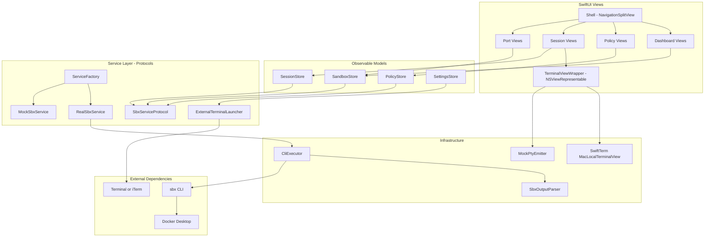
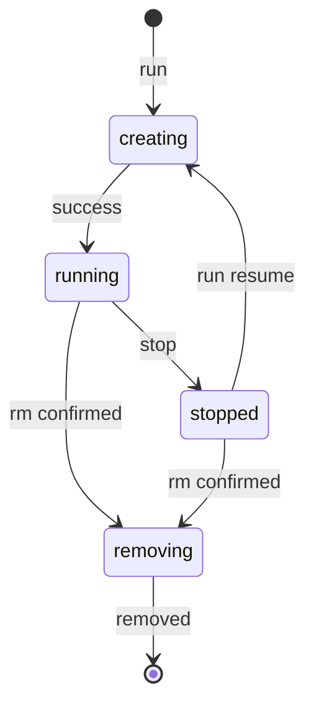
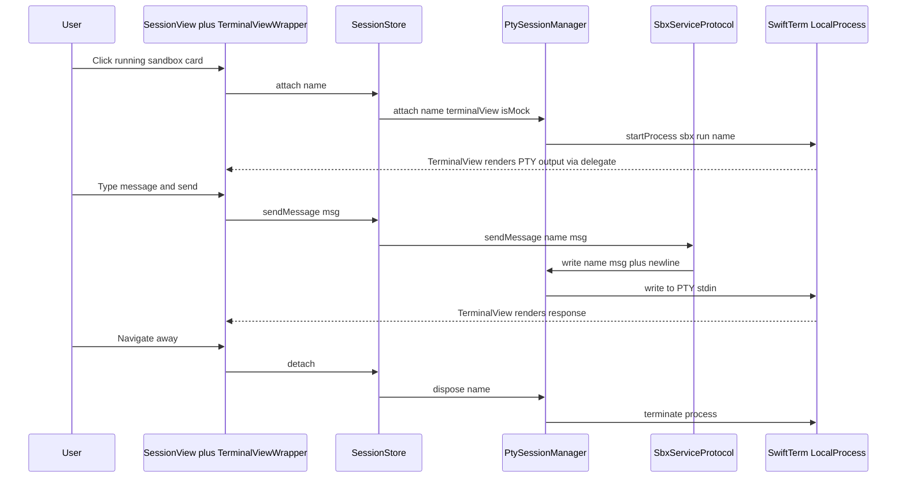
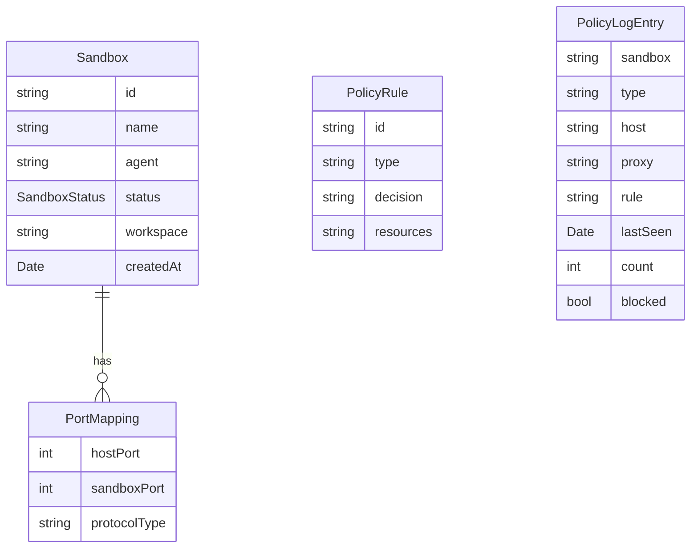

# Design Document

## Overview

**Purpose**: sbx-ui delivers a macOS native desktop GUI that wraps the Docker Sandbox (`sbx`) CLI, enabling developers to manage sandbox lifecycles, network policies, port forwarding, and Claude Code agent sessions without terminal interaction.

**Users**: Individual developers and small teams using Docker Sandbox for AI-assisted coding. Primary workflow: create a project from a local Git repo, launch Claude Code, interact via chat-style UI, manage security policies, and inspect sandbox state — all from a single application window.

**Impact**: Introduces a new macOS native application built with SwiftUI and Swift. No existing systems are modified. The app wraps the `sbx` CLI as an external dependency and can operate entirely against an in-memory mock for development and testing.

### Goals
- Provide a visual interface for all Phase 1 `sbx` CLI operations (lifecycle, policies, ports, sessions)
- Enable chat-style interaction with Claude Code sessions running inside sandboxes
- Deliver a full in-memory mock layer enabling E2E testing without Docker Desktop
- Follow "The Technical Monolith" design system for a premium developer-tool aesthetic
- Support opening bash shells in external terminal applications (Terminal.app, iTerm)

### Non-Goals
- Branch mode and Git worktree management (Phase 2)
- Multi-agent support beyond Claude Code (Phase 2)
- IDE integration — VSCode, Xcode, IntelliJ (Phase 2)
- Template customization UI (Phase 2)
- Notification center and file embedding in chat (Phase 2)
- Shared workspaces across agents (Phase 2)
- Organization-level governance UI (Phase 2)
- Windows and Linux support (Phase 2)
- Mac App Store distribution (requires App Sandbox, incompatible with CLI spawning)

## Architecture

> Detailed discovery findings are in `research.md`. All architectural decisions are captured here.

### Architecture Pattern & Boundary Map

**Selected pattern**: Single-process SwiftUI application with `@Observable` model layer and protocol-based service injection. `SbxServiceProtocol` acts as the primary ports-and-adapters boundary between the application and the `sbx` CLI, enabling transparent mock/real implementation swapping.

**Domain boundaries**:
- **Service Layer**: Owns all system I/O — CLI spawning, PTY management, external terminal launching. Defined by Swift protocols. Runs on background actors for thread safety.
- **Model Layer**: `@Observable` classes managing domain state (sandboxes, policies, sessions). Bridge between services and views.
- **View Layer**: SwiftUI views. Reads `@Observable` models. No direct service access — all mutations go through model methods.

**Existing patterns preserved**: N/A (greenfield project)

**New components rationale**: All components are new. SbxServiceProtocol is the foundational abstraction enabling mock-driven development and E2E testing.

**Steering compliance**: macOS native (SwiftUI + Swift), replacing the original Electron stack. Follows "The Technical Monolith" design system via SwiftUI color/font extensions.



### Technology Stack

| Layer | Choice / Version | Role in Feature | Notes |
|-------|------------------|-----------------|-------|
| UI Framework | SwiftUI (macOS 15+) | Declarative UI, navigation, layout | NavigationSplitView for sidebar+detail |
| AppKit Interop | NSViewRepresentable | Terminal view bridge | SwiftTerm NSView in SwiftUI |
| State | @Observable (Observation framework) | Reactive model layer | One @Observable class per domain |
| Terminal | SwiftTerm 1.13+ | PTY management + ANSI rendering | MacLocalTerminalView for real; headless Terminal for mock |
| CLI Execution | Foundation Process | Spawns sbx CLI commands | Array-form args prevent injection |
| Async | Swift Concurrency | async/await, actor, AsyncStream | Polling, background CLI operations |
| Persistence | UserDefaults | User preferences (terminal choice) | Simple key-value; SwiftData not needed |
| App Security | Hardened Runtime (no App Sandbox) | Notarization, direct distribution | Required for CLI tool access |
| Distribution | DMG via create-dmg or Xcode archive | macOS direct distribution | Signed + notarized |
| Unit Testing | Swift Testing (Xcode 16+) | Service, parser, model tests | @Test, #expect, parameterized |
| UI Testing | XCUITest | E2E user flow tests | Mock mode via launch environment |
| Snapshot Testing | swift-snapshot-testing | Visual regression | NSHostingView wrapping |
| Package Manager | Swift Package Manager | SwiftTerm dependency | Package.swift |

## System Flows

### Sandbox Lifecycle State Machine



**Key decisions**:
- `creating` and `removing` are transient states during which UI controls are disabled (2.5)
- Port mappings are cleared on transition to `stopped`, matching real `sbx` behavior (5.7)
- Resuming a stopped sandbox calls `run` with the sandbox name, not workspace path (3.3)
- Duplicate workspace detection returns existing sandbox instead of creating a new one (1.5)

### Session Interaction Flow



**Key decisions**:
- PTY lifecycle is owned by `PtySessionManager`, not `SbxServiceProtocol` — this avoids impedance mismatch with SwiftTerm's delegate-based architecture
- Real mode: `PtySessionManager` configures SwiftTerm's `LocalProcess` which feeds data directly to `TerminalView` via `LocalProcessDelegate`/`TerminalViewDelegate` — no callback extraction needed
- Mock mode: `MockPtyEmitter` feeds simulated ANSI data to a `TerminalView` via the headless `Terminal` engine
- `sendMessage` on `SbxServiceProtocol` delegates to `PtySessionManager.write()` (6.3)
- Session auto-reattaches when a stopped sandbox resumes if the session panel is open (6.5)
- Only one session active at a time per current UI design
- SwiftTerm's `TerminalView` (NSView) is wrapped via `NSViewRepresentable` for SwiftUI integration

## Requirements Traceability

| Requirement | Summary | Components | Interfaces | Flows |
|-------------|---------|------------|------------|-------|
| 1.1 | Directory picker on deploy button | CreateProjectSheet | NSOpenPanel | — |
| 1.2 | Create sandbox from selected directory | CreateProjectSheet, SandboxStore | SbxServiceProtocol.run | Lifecycle |
| 1.3 | Auto-generate sandbox name | SbxServiceProtocol.run, MockSbxService | RunOptions | — |
| 1.4 | Cancel picker without side effects | CreateProjectSheet | NSOpenPanel | — |
| 1.5 | Return existing for duplicate workspace | SbxServiceProtocol.run, MockSbxService | SbxServiceProtocol.run | — |
| 2.1 | Grid layout of sandbox cards | SandboxGridView, SandboxCardView | SandboxStore | — |
| 2.2 | Card shows name, agent, status, workspace | SandboxCardView | Sandbox type | — |
| 2.3 | Green LED pulse for running | StatusChipView | SandboxStatus | — |
| 2.4 | STOPPED chip without animation | StatusChipView | SandboxStatus | — |
| 2.5 | Spinner and disabled during transitions | SandboxCardView, StatusChipView | SandboxStatus | — |
| 2.6 | Global stats bar | GlobalStatsView | SandboxStore | — |
| 2.7 | Poll sandbox list every 3s | SandboxStore | SbxServiceProtocol.list | — |
| 3.1 | Launch sandbox | SandboxStore, SandboxCardView | SbxServiceProtocol.run | Lifecycle |
| 3.2 | Stop running sandbox | SandboxStore, SandboxCardView | SbxServiceProtocol.stop | Lifecycle |
| 3.3 | Resume stopped sandbox | SandboxStore, SandboxCardView | SbxServiceProtocol.run | Lifecycle |
| 3.4 | Confirmation before termination | SandboxCardView | — | — |
| 3.5 | Remove after confirmation | SandboxStore | SbxServiceProtocol.rm | Lifecycle |
| 3.6 | Cancel termination does nothing | SandboxCardView | — | — |
| 4.1 | Policy panel listing rules | PolicyPanelView, PolicyRuleRow | PolicyStore | — |
| 4.2 | Pre-seeded Balanced defaults | MockSbxService, RealSbxService | SbxServiceProtocol.policyList | — |
| 4.3 | Allow policy submission | AddPolicySheet, PolicyStore | SbxServiceProtocol.policyAllow | — |
| 4.4 | Deny policy submission | AddPolicySheet, PolicyStore | SbxServiceProtocol.policyDeny | — |
| 4.5 | Remove policy rule | PolicyRuleRow, PolicyStore | SbxServiceProtocol.policyRemove | — |
| 4.6 | Network activity log table | PolicyLogView | SbxServiceProtocol.policyLog | — |
| 4.7 | Log filtering by sandbox and blocked | PolicyLogView | PolicyStore | — |
| 5.1 | Port panel per sandbox | PortPanelView, PortMappingRow | SbxServiceProtocol.portsList | — |
| 5.2 | Publish port mapping | AddPortSheet, PortPanelView | SbxServiceProtocol.portsPublish | — |
| 5.3 | Unpublish port mapping | PortMappingRow | SbxServiceProtocol.portsUnpublish | — |
| 5.4 | Port chips on sandbox card | SandboxCardView | Sandbox.ports | — |
| 5.5 | Reject duplicate host port | SbxServiceProtocol.portsPublish | SbxServiceError | — |
| 5.6 | Disable port publish when stopped | PortPanelView | SandboxStatus | — |
| 5.7 | Clear ports on stop | MockSbxService, SandboxStore | SbxServiceProtocol.stop | Lifecycle |
| 6.1 | Session panel with split layout | SessionPanelView | SessionStore | Session |
| 6.2 | Terminal with ANSI support | TerminalViewWrapper | SwiftTerm | Session |
| 6.3 | Send message to PTY stdin | ChatInputView, SessionStore | SbxServiceProtocol.sendMessage | Session |
| 6.4 | Agent status bar | AgentStatusBar | Sandbox type | — |
| 6.5 | Auto-reattach on resume | SessionStore | PtySessionManager.attach | Session |
| 6.6 | Detach on navigate away | SessionStore | PtySessionManager.dispose | Session |
| 7.1 | Mock mode via SBX_MOCK env | ServiceFactory | — | — |
| 7.2 | MockSbxService implements full protocol | MockSbxService | SbxServiceProtocol | — |
| 7.3 | Realistic lifecycle delays | MockSbxService | — | Lifecycle |
| 7.4 | Pre-seeded Balanced defaults | MockSbxService | — | — |
| 7.5 | Simulated terminal output | MockPtyEmitter | PtyHandle | Session |
| 7.6 | Simulated agent response sequence | MockPtyEmitter | PtyHandle | Session |
| 7.7 | Same validation rules as real | MockSbxService | SbxServiceProtocol | — |
| 8.1 | Shell with sidebar, topbar, content | ShellView, SidebarView | — | — |
| 8.2 | Sidebar nav for dashboard and policies | SidebarView | — | — |
| 8.3 | Dark surface hierarchy design system | All UI views | DesignSystem | — |
| 8.4 | Font stack Inter, JetBrains Mono, Space Grotesk | All UI views | DesignSystem | — |
| 8.5 | Max border-radius 0.5rem | All UI views | DesignSystem | — |
| 9.1 | Secure service access | SbxServiceProtocol (protocol boundary) | — | — |
| 9.2 | Typed API for all operations | SbxServiceProtocol | — | — |
| 9.3 | CLI spawning in service layer only | RealSbxService, CliExecutor | — | — |
| 9.4 | Error state for missing sbx or Docker | RealSbxService, ShellView | SbxServiceError | — |
| 9.5 | Error toast for CLI failures | ShellView, SandboxStore | SbxServiceError | — |
| 10.1 | E2E coverage for all Phase 1 features | XCUITest specs | — | All |
| 10.2 | Run against MockSbxService | XCUITest setup | ServiceFactory | — |
| 10.3 | Lifecycle status transition test | SandboxLifecycleUITests | — | Lifecycle |
| 10.4 | Policy CRUD test | PolicyManagementUITests | — | — |
| 10.5 | Port forwarding CRUD test | PortForwardingUITests | — | — |
| 10.6 | Session messaging test | SessionMessagingUITests | — | Session |
| 11.1 | Open bash shell in external terminal | ExternalTerminalLauncher | ExternalTerminalProtocol | — |
| 11.2 | Support Terminal.app and iTerm | ExternalTerminalLauncher | TerminalApp type | — |
| 11.3 | Detect installed terminals | ExternalTerminalLauncher | NSWorkspace | — |
| 11.4 | Default to Terminal.app | ExternalTerminalLauncher | TerminalApp type | — |
| 11.5 | Setting for preferred terminal | SettingsStore | UserDefaults | — |
| 11.6 | Error on terminal launch failure | ExternalTerminalLauncher | SbxServiceError | — |
| 11.7 | Disable shell when stopped | SandboxCardView | SandboxStatus | — |

## Components and Interfaces

| Component | Domain | Intent | Req Coverage | Key Dependencies | Contracts |
|-----------|--------|--------|--------------|------------------|-----------|
| SbxServiceProtocol | Services | Central contract for all sbx operations | All | — | Service |
| RealSbxService | Services | Wraps sbx CLI via Process spawning | All runtime | CliExecutor P0, SbxOutputParser P0 | Service |
| MockSbxService | Services | In-memory simulation for dev and E2E | 7.1–7.7 | — | Service, State |
| ServiceFactory | Services | Selects real or mock by env var | 7.1 | SbxServiceProtocol P0 | Service |
| PtySessionManager | Services / PTY | Manages PTY sessions per sandbox | 6.1–6.6 | SwiftTerm P0, MockPtyEmitter P1 | Service |
| MockPtyEmitter | Services / PTY | Simulates Claude Code terminal output | 7.5, 7.6 | — | Event |
| CliExecutor | Services / Utils | Spawns sbx CLI and captures output | All runtime | Foundation.Process P0 | Service |
| SbxOutputParser | Services / Utils | Parses column-delimited CLI stdout | All runtime | — | Service |
| ExternalTerminalLauncher | Services | Opens bash shells in external terminals | 11.1–11.6 | NSAppleScript P0, NSWorkspace P0 | Service |
| SandboxStore | Models | Sandbox list state with polling | 2.1–2.7, 3.1–3.6 | SbxServiceProtocol P0 | State |
| PolicyStore | Models | Policy rules and log state | 4.1–4.7 | SbxServiceProtocol P0 | State |
| SessionStore | Models | Active session state and PTY relay | 6.1–6.6 | PtySessionManager P0 | State |
| SettingsStore | Models | User preferences persistence | 11.5 | UserDefaults P0 | State |
| ShellView | Views / Layout | App shell with sidebar and content | 8.1–8.5 | — | — |
| SandboxGridView | Views / Dashboard | Card grid rendering all sandboxes | 2.1 | SandboxStore P0 | — |
| SandboxCardView | Views / Dashboard | Sandbox card with status and actions | 2.2–2.5, 3.1–3.6, 5.4, 11.7 | SandboxStore P0 | — |
| StatusChipView | Views / Dashboard | LIVE pulse or STOPPED indicator | 2.3, 2.4, 2.5 | — | — |
| CreateProjectSheet | Views / Dashboard | Directory picker and name input | 1.1–1.5 | NSOpenPanel P0 | — |
| GlobalStatsView | Views / Dashboard | Running and total sandbox counts | 2.6 | SandboxStore P0 | — |
| PolicyPanelView | Views / Policies | Policy rule list with add and remove | 4.1–4.5 | PolicyStore P0 | — |
| AddPolicySheet | Views / Policies | Domain input with allow and deny toggle | 4.3, 4.4 | PolicyStore P0 | — |
| PolicyLogView | Views / Policies | Activity log with filtering | 4.6, 4.7 | PolicyStore P0 | — |
| PortPanelView | Views / Ports | Per-sandbox port mapping list | 5.1–5.3, 5.6 | SandboxStore P0 | — |
| AddPortSheet | Views / Ports | Port input with validation | 5.2, 5.5 | — | — |
| SessionPanelView | Views / Session | Split layout with terminal and chat | 6.1 | SessionStore P0 | — |
| ChatInputView | Views / Session | Message composer with send action | 6.3 | SessionStore P0 | — |
| TerminalViewWrapper | Views / Session | SwiftTerm NSView wrapped for SwiftUI | 6.2 | SwiftTerm P0 | — |
| AgentStatusBar | Views / Session | Model, sandbox, uptime, connection | 6.4 | SessionStore P0 | — |

### Service Layer

#### SbxServiceProtocol

| Field | Detail |
|-------|--------|
| Intent | Central contract defining all sbx operations; implemented by real and mock |
| Requirements | All |

**Responsibilities & Constraints**
- Defines the compile-time contract between real CLI integration and in-memory mock
- All methods are async and throwing
- Implementations throw `SbxServiceError` for operation failures
- PTY session lifecycle (`attach`/`detach`) is owned by `PtySessionManager`, not this protocol — only `sendMessage` bridges to the PTY

**Sendable and Existential Usage**
- Protocol is `: Sendable` to allow crossing actor boundaries
- Stores hold the service as `any SbxServiceProtocol` (existential) for runtime polymorphism via `ServiceFactory`
- Both implementations (`RealSbxService`, `MockSbxService`) are `actor` types, which are inherently `Sendable`
- Since `@MainActor`-isolated stores call `async` methods on actor-isolated services, all calls cross actor boundaries via `await` — this is safe and compiler-verified
- If `Sendable` warnings arise from existential erasure, use `sending` parameter annotations or `nonisolated` protocol method declarations as needed

**Contracts**: Service [x]

##### Service Interface
```swift
enum SandboxStatus: String, Sendable, Codable {
    case running, stopped, creating, removing
}

struct Sandbox: Identifiable, Sendable {
    let id: String
    let name: String
    let agent: String  // "claude"
    var status: SandboxStatus
    let workspace: String
    var ports: [PortMapping]
    let createdAt: Date
}

struct PolicyRule: Identifiable, Sendable {
    let id: String
    let type: String  // "network"
    let decision: PolicyDecision
    let resources: String
}

enum PolicyDecision: String, Sendable, Codable {
    case allow, deny
}

struct PolicyLogEntry: Sendable {
    let sandbox: String
    let type: String  // "network"
    let host: String
    let proxy: String  // "forward", "transparent", "network"
    let rule: String
    let lastSeen: Date
    let count: Int
    let blocked: Bool
}

struct PortMapping: Sendable {
    let hostPort: Int
    let sandboxPort: Int
    let protocolType: String  // "tcp"
}

struct RunOptions: Sendable {
    var name: String?
    var prompt: String?
}

protocol PtyHandle: Sendable {
    func onData(_ callback: @escaping @Sendable (String) -> Void)
    func write(_ data: String)
    func dispose()
}

enum SbxServiceError: Error, Sendable {
    case notFound(String)
    case alreadyExists(String)
    case portConflict(Int)
    case notRunning(String)
    case cliError(String)
    case dockerNotRunning
    case invalidName(String)
}

protocol SbxServiceProtocol: Sendable {
    // Lifecycle
    func list() async throws -> [Sandbox]
    func run(agent: String, workspace: String, opts: RunOptions?) async throws -> Sandbox
    func stop(name: String) async throws
    func rm(name: String) async throws

    // Network policies
    func policyList() async throws -> [PolicyRule]
    func policyAllow(resources: String) async throws -> PolicyRule
    func policyDeny(resources: String) async throws -> PolicyRule
    func policyRemove(resource: String) async throws
    func policyLog(sandboxName: String?) async throws -> [PolicyLogEntry]

    // Port forwarding
    func portsList(name: String) async throws -> [PortMapping]
    func portsPublish(name: String, hostPort: Int, sbxPort: Int) async throws -> PortMapping
    func portsUnpublish(name: String, hostPort: Int, sbxPort: Int) async throws

    // Session messaging (PTY lifecycle managed by PtySessionManager, not here)
    func sendMessage(name: String, message: String) async throws
}
```

- Preconditions: Sandbox must exist for stop, rm, ports, sendMessage. Sandbox must be running for sendMessage, portsPublish. Sandbox names must match `^[a-z0-9][a-z0-9-]*$` (lowercase alphanumeric and hyphens, no leading hyphen); `run` throws `invalidName` otherwise.
- Postconditions: `run` returns sandbox transitioning from "creating" to "running". `stop` clears port mappings. `rm` removes all associated data.
- Invariants: No two sandboxes share the same name. No two port mappings share the same host port across all sandboxes.

> **Note on PTY session lifecycle**: `attach` and `detachSession` are intentionally excluded from `SbxServiceProtocol`. In real mode, SwiftTerm's `MacLocalTerminalView` manages the full PTY-to-rendering pipeline internally via its delegate model — wrapping this in a callback-based `PtyHandle` would fight SwiftTerm's design. Instead, `PtySessionManager` owns session lifecycle directly, with mode-specific paths: real mode configures `MacLocalTerminalView` with the `sbx run <name>` command; mock mode uses `MockPtyEmitter` feeding data to a headless `TerminalView`. `sendMessage` remains on the protocol because it writes to the PTY stdin regardless of mode.

#### RealSbxService

| Field | Detail |
|-------|--------|
| Intent | Implements SbxServiceProtocol by spawning sbx CLI commands and parsing stdout |
| Requirements | All runtime operations |

**Responsibilities & Constraints**
- Implemented as a Swift `actor` for thread-safe mutable state
- Spawns `sbx` CLI via CliExecutor for each operation
- Delegates stdout parsing to SbxOutputParser
- Detects missing `sbx` CLI or Docker Desktop and throws `SbxServiceError.cliError` or `.dockerNotRunning`

**Dependencies**
- Outbound: CliExecutor — spawns processes (P0)
- Outbound: SbxOutputParser — parses CLI output (P0)
- External: sbx CLI — must be installed and on PATH (P0)

**Contracts**: Service [x]

**Implementation Notes**
- Integration: CLI commands mapped per method — `list` → `sbx ls`, `run` → `sbx run claude <workspace> --name <name>`, `stop` → `sbx stop <name>`, `rm` → `sbx rm <name>`, policy and ports methods map to respective `sbx policy` and `sbx ports` subcommands
- Validation: Validates `sbx` availability on initialization; surfaces meaningful error for missing CLI
- Risks: CLI output format changes could break parsing; mitigated by parser unit tests and `--json` where available

#### MockSbxService

| Field | Detail |
|-------|--------|
| Intent | In-memory SbxServiceProtocol implementation for development and E2E testing |
| Requirements | 7.1, 7.2, 7.3, 7.4, 7.5, 7.6, 7.7 |

**Responsibilities & Constraints**
- Implemented as a Swift `actor` for thread-safe mutable state
- Maintains in-memory dictionaries for sandboxes, policies, port mappings
- Pre-seeds Balanced network policy defaults on construction (api.anthropic.com, *.npmjs.org, github.com, *.github.com, registry.hub.docker.com, *.docker.io, *.googleapis.com, api.openai.com, *.pypi.org, files.pythonhosted.org)
- Simulates lifecycle transitions with realistic delays (creating: ~800ms, stop: ~300ms, remove: ~200ms) via `Task.sleep`
- Enforces same validation rules as real: rejects duplicate host ports, clears ports on stop, returns existing sandbox for duplicate workspace

**Contracts**: Service [x] / State [x]

##### State Management
- State model: `[String: Sandbox]` for sandboxes, `[String: PolicyRule]` for policies, `[String: [PortMapping]]` for port mappings, `[PolicyLogEntry]` for logs
- Persistence: In-memory only, no disk persistence
- Concurrency: Actor isolation provides thread safety

**Implementation Notes**
- Integration: Constructor seeds Balanced policy defaults. Auto-generates name as `claude-<dirname>` if not specified.
- Validation: Duplicate workspace returns existing sandbox. Duplicate host port throws `.portConflict`. Stopped sandbox rejects port publish with `.notRunning`.
- Risks: Mock drift from real behavior; mitigated by shared protocol contract and matching E2E assertions

#### PtySessionManager

| Field | Detail |
|-------|--------|
| Intent | Owns PTY session lifecycle per sandbox; bridges real SwiftTerm and mock modes |
| Requirements | 6.1, 6.2, 6.3, 6.5, 6.6 |

**Responsibilities & Constraints**
- Implemented as a Swift `actor` — owns all PTY session state
- Maintains at most one active PTY per sandbox name
- **Real mode**: Configures `MacLocalTerminalView` (provided by `TerminalViewWrapper`) with the command `sbx run <name>`. SwiftTerm internally manages the PTY-to-rendering pipeline via its delegate model (`LocalProcessDelegate` → `TerminalViewDelegate`). PtySessionManager tracks the active `LocalProcess` reference for write and dispose.
- **Mock mode**: Creates `MockPtyEmitter` conforming to `PtyHandle` and wires it to a headless SwiftTerm `TerminalView` for rendering. Data flows from `MockPtyEmitter` → `Terminal` engine → `TerminalView`.
- Disposes PTY on detach or sandbox stop/removal

**Dependencies**
- External: SwiftTerm — PTY spawning and terminal rendering (P0)
- Inbound: SessionStore — attach, send, detach calls (P0)
- Outbound: MockPtyEmitter — mock terminal simulation (P1)

**Contracts**: Service [x]

##### Service Interface
```swift
actor PtySessionManager {
    /// Real mode: configures the provided TerminalView with sbx run command and starts the process.
    /// Mock mode: creates MockPtyEmitter and wires it to the provided TerminalView.
    func attach(name: String, terminalView: AnyObject, isMock: Bool) async throws

    /// Writes data to the active PTY stdin for the given sandbox.
    func write(name: String, data: String)

    /// Disposes the PTY session for the given sandbox.
    func dispose(name: String)

    /// Disposes all active PTY sessions.
    func disposeAll()

    /// Returns whether a PTY session is active for the given sandbox.
    func isAttached(name: String) -> Bool
}
```

- Preconditions: Sandbox must be running for attach. Name must be attached for write and dispose. `terminalView` must be a SwiftTerm `TerminalView` instance (type-erased for protocol flexibility).
- Postconditions: `attach` starts the PTY process and begins rendering to the terminal view. `dispose` terminates the process and removes from tracking.
- Design rationale: `attach` accepts the terminal view reference because SwiftTerm's real-mode `LocalProcess` needs to be wired directly to the view's delegate. This avoids the impedance mismatch of extracting PTY data into callbacks and re-feeding it.

#### MockPtyEmitter

| Field | Detail |
|-------|--------|
| Intent | Simulates Claude Code terminal output for mock sessions |
| Requirements | 7.5, 7.6 |

**Responsibilities & Constraints**
- Conforms to `PtyHandle` protocol
- Simulates startup sequence: Claude Code banner, model info, workspace path, prompt character
- Simulates agent response on write: thinking → reading → writing → done → prompt
- Uses realistic delays between emissions via `Task.sleep`

**Contracts**: Event [x]

##### Event Contract
- Published events: data callbacks (String — ANSI-encoded terminal output) via `onData` closure
- Subscribed events: none (input via `write` method)
- Delivery guarantees: In-order, delayed via `Task.sleep` to simulate real agent behavior

#### CliExecutor

| Field | Detail |
|-------|--------|
| Intent | Spawns sbx CLI processes and returns captured stdout, stderr, exit code |
| Requirements | All runtime via RealSbxService |

**Contracts**: Service [x]

##### Service Interface
```swift
struct CliResult: Sendable {
    let stdout: String
    let stderr: String
    let exitCode: Int32
}

protocol CliExecutorProtocol: Sendable {
    func exec(command: String, args: [String]) async throws -> CliResult
    func execJson<T: Decodable & Sendable>(command: String, args: [String]) async throws -> T
}
```

- Preconditions: `sbx` binary must be on system PATH
- Postconditions: Returns complete stdout/stderr after process exits
- Invariants: Never modifies command arguments; passes through as-is. Always uses `Process` with array-form arguments (never shell string interpolation) to prevent command injection.

**Implementation Notes**
- Uses `/usr/bin/env` as executable with `["sbx", ...args]` to locate `sbx` on PATH
- Wraps `Process.waitUntilExit()` in `withCheckedContinuation` for async/await integration
- `AsyncStream` wraps `Pipe.readabilityHandler` for streaming output when needed

#### SbxOutputParser

| Field | Detail |
|-------|--------|
| Intent | Parses column-delimited sbx CLI stdout into typed domain objects |
| Requirements | All runtime via RealSbxService |

**Contracts**: Service [x]

##### Service Interface
```swift
struct SbxOutputParser {
    static func parseSandboxList(_ stdout: String) -> [Sandbox]
    static func parsePolicyList(_ stdout: String) -> [PolicyRule]
    static func parsePolicyLog(_ stdout: String) -> [PolicyLogEntry]
    static func parsePortsList(_ stdout: String) -> [PortMapping]
}
```

**Implementation Notes**
- Integration: Column-based parsing using header position detection via `String.Index` offsets (not simple whitespace split — fields like workspace paths may contain spaces)
- Validation: Returns empty arrays for empty or header-only output; logs warnings for unparseable lines via `os.Logger`
- Risks: CLI output format changes; prefer `--json` flag where available (e.g., `sbx policy log --json`)

#### ServiceFactory

| Field | Detail |
|-------|--------|
| Intent | Creates appropriate SbxServiceProtocol implementation based on environment |
| Requirements | 7.1 |

**Contracts**: Service [x]

##### Service Interface
```swift
struct ServiceFactory {
    static func create() -> any SbxServiceProtocol
}
```

- When `SBX_MOCK` environment variable is `"1"` (via `ProcessInfo.processInfo.environment["SBX_MOCK"]`), returns `MockSbxService`
- Otherwise returns `RealSbxService`

#### ExternalTerminalLauncher

| Field | Detail |
|-------|--------|
| Intent | Detects installed terminal apps and launches bash shells inside sandboxes |
| Requirements | 11.1, 11.2, 11.3, 11.4, 11.5, 11.6 |

**Responsibilities & Constraints**
- Detects available terminal applications via `NSWorkspace.shared.urlForApplication(withBundleIdentifier:)`
- Launches terminal windows via `NSAppleScript` with per-application AppleScript templates
- Executes `sbx exec -it <name> bash` inside the launched terminal
- Defaults to Terminal.app when no preference is set

**Contracts**: Service [x]

##### Service Interface
```swift
enum TerminalApp: String, Sendable, Codable, CaseIterable {
    case terminal  // com.apple.Terminal
    case iterm     // com.googlecode.iterm2
}

protocol ExternalTerminalProtocol: Sendable {
    func detectAvailable() async -> [TerminalApp]
    func openShell(sandboxName: String, app: TerminalApp) async throws
}
```

- Preconditions: Target terminal application must be installed. Sandbox must be running. Sandbox name must pass the same `^[a-z0-9][a-z0-9-]*$` validation before interpolation into AppleScript.
- Postconditions: A new terminal window opens with an interactive bash shell inside the specified sandbox.

**Implementation Notes**
- Integration: Terminal.app via `NSAppleScript` with `tell app "Terminal" to do script "sbx exec -it <name> bash"`; iTerm via iTerm2 AppleScript API. Sandbox name escaped for AppleScript string context (backslash-escape `\` and `"`) before interpolation.
- Validation: `NSWorkspace.shared.urlForApplication(withBundleIdentifier:)` for detection — `com.apple.Terminal` (always present) and `com.googlecode.iterm2`
- Risks: Non-standard installation paths handled by bundle ID lookup; user preference setting as fallback (11.5)

### Model Layer

#### SandboxStore

| Field | Detail |
|-------|--------|
| Intent | Manages sandbox list state with polling and mutation actions |
| Requirements | 2.1–2.7, 3.1–3.6 |

**Contracts**: State [x]

##### State Management
```swift
@MainActor @Observable final class SandboxStore {
    var sandboxes: [Sandbox] = []
    var loading: Bool = false
    var error: String?

    private let service: any SbxServiceProtocol
    private var pollingTask: Task<Void, Never>?

    func fetchSandboxes() async
    func createSandbox(workspace: String, name: String?) async throws -> Sandbox
    func stopSandbox(name: String) async throws
    func removeSandbox(name: String) async throws
    func startPolling()
    func stopPolling()
}
```

- State model: Array of Sandbox objects, loading flag, error string
- Persistence: In-memory; refreshed via polling every 3 seconds
- Concurrency: `@MainActor` ensures all property mutations happen on the main thread. Polling via `Task` with `Task.sleep(for: .seconds(3))` loop; mutations trigger immediate re-fetch. Service calls use `await` to cross actor boundaries.

#### PolicyStore

| Field | Detail |
|-------|--------|
| Intent | Manages network policy rules and activity log state |
| Requirements | 4.1–4.7 |

**Contracts**: State [x]

##### State Management
```swift
@MainActor @Observable final class PolicyStore {
    var rules: [PolicyRule] = []
    var logEntries: [PolicyLogEntry] = []
    var logFilter: LogFilter = LogFilter()
    var loading: Bool = false
    var error: String?

    struct LogFilter {
        var sandboxName: String?
        var blockedOnly: Bool = false
    }

    private let service: any SbxServiceProtocol

    func fetchPolicies() async
    func addAllow(resources: String) async throws
    func addDeny(resources: String) async throws
    func removeRule(resource: String) async throws
    func fetchLog(sandboxName: String?) async
    func setLogFilter(_ filter: LogFilter)
}
```

- State model: Arrays of PolicyRule and PolicyLogEntry, filter state
- Persistence: In-memory; rules fetched on view mount; log fetched on demand
- Concurrency: `@MainActor` ensures all property mutations happen on the main thread. Mutations trigger immediate re-fetch of rules list.

#### SessionStore

| Field | Detail |
|-------|--------|
| Intent | Manages active PTY session state |
| Requirements | 6.1–6.6 |

**Contracts**: State [x]

##### State Management
```swift
@MainActor @Observable final class SessionStore {
    var activeSandbox: String?
    var connected: Bool = false
    var error: String?

    private let ptyManager: PtySessionManager
    private let service: any SbxServiceProtocol

    func attach(name: String) async throws
    func sendMessage(_ message: String) async throws
    func detach()
}
```

- State model: Active sandbox name, connection flag
- Persistence: In-memory; session is transient per user interaction
- Concurrency: `@MainActor` ensures all property mutations happen on the main thread. Only one active session at a time; attaching a new session detaches the previous. PTY lifecycle is delegated to `PtySessionManager`.

#### SettingsStore

| Field | Detail |
|-------|--------|
| Intent | Persists user preferences including preferred terminal application |
| Requirements | 11.5 |

**Contracts**: State [x]

##### State Management
```swift
@MainActor @Observable final class SettingsStore {
    var preferredTerminal: TerminalApp? {
        didSet {
            UserDefaults.standard.set(preferredTerminal?.rawValue, forKey: "preferredTerminal")
        }
    }

    init() {
        if let raw = UserDefaults.standard.string(forKey: "preferredTerminal") {
            self.preferredTerminal = TerminalApp(rawValue: raw)
        }
    }
}
```

- State model: Terminal preference
- Persistence: `UserDefaults` for simple key-value storage
- Concurrency: Single writer; reads are synchronous via `@Observable`

### View Layer (Summary)

UI views follow "The Technical Monolith" design system. These are presentational views with no new architectural boundaries.

**Design System**

The design system is implemented via SwiftUI extensions:
- **Colors**: Dark surface hierarchy via `Color` extensions — `surfaceLowest` (#0E0E0E), `surface` (#131313), `surfaceContainer` (#1C1B1B), `surfaceContainerHigh` (#2A2A2A), `surfaceContainerHighest` (#353534). Accent: `#ADC6FF`. Secondary/LIVE: `#4EDEA3`. Error: `#F2B8B5`. No 1px borders — tonal depth for boundaries.
- **Fonts**: Inter via `Font.custom("Inter", ...)` for UI elements, JetBrains Mono for code/metrics, Space Grotesk for labels. Registered via Info.plist `ATSApplicationFontsPath`.
- **Corners**: Maximum `cornerRadius` of 8 (0.5rem equivalent) for all components.
- **Dark mode**: `.preferredColorScheme(.dark)` applied at the `WindowGroup` level.

**Layout**
- **ShellView**: Root layout using `NavigationSplitView` with fixed sidebar and scrollable detail area. Provides routing between dashboard and policy views via sidebar selection binding. Requirements: 8.1–8.5.
- **SidebarView**: Navigation list with sections. Links: Dashboard, Policies, Settings. "Deploy Agent" button at bottom. Space Grotesk labels, uppercase styling.

**Dashboard**
- **SandboxGridView**: `LazyVGrid` rendering `SandboxCardView` per sandbox plus a "+" placeholder card. Adaptive columns for responsive layout.
- **SandboxCardView**: Displays sandbox name, agent type, status chip, workspace path, port chips (`8080→3000`), and action buttons (pause, open shell, open terminal, terminate). Hover effect via `.onHover` modifier. "Terminate Agent" in error color. Uses `.confirmationDialog` for termination confirmation (3.4).
- **StatusChipView**: Green `secondary` (#4EDEA3) 4px circle with pulse animation (`.animation(.easeInOut.repeatForever())`) for "running" (LIVE). `surfaceContainerHighest` for "stopped" (STOPPED). `ProgressView()` spinner for "creating"/"removing". Space Grotesk label-sm typeface.
- **CreateProjectSheet**: `.sheet` modifier with `.fileImporter` for native directory picker (NSOpenPanel). Optional name `TextField`. Create/Cancel buttons. JetBrains Mono for path display.
- **GlobalStatsView**: Stat bar showing running count and total count. JetBrains Mono for numbers, Space Grotesk labels.

**Policies**
- **PolicyPanelView**: Full-view panel listing `PolicyRuleRow` components with "Add Policy" button triggering `AddPolicySheet`. Fetches rules via `.task { }` on appear.
- **AddPolicySheet**: `.sheet` with domain `TextField` (comma-separated), `Picker` for allow/deny, submit/cancel. JetBrains Mono for domain input.
- **PolicyLogView**: `Table` view with columns: sandbox, host, proxy type, rule, last seen, count, status. Filter controls for sandbox name `Picker` and blocked-only `Toggle`. Subtle dividers using `surfaceContainerHigh` at 15% opacity.

**Ports**

Port state lives in `Sandbox.ports[]` within `SandboxStore`. Views call port service methods directly through `SandboxStore` and trigger `fetchSandboxes()` after each mutation. No separate PortStore needed.

- **PortPanelView**: Per-sandbox inspector showing `PortMappingRow` components. Reads port data from `SandboxStore` via the parent sandbox's `ports[]` field. Displays "ports cleared on stop" notice when sandbox is stopped. Add button disabled when stopped (5.6).
- **AddPortSheet**: `.sheet` with host port and sandbox port `TextField` with `.keyboardType(.numberPad)` style. Validates numeric input; shows inline error for port conflicts.

**Session**
- **SessionPanelView**: `VSplitView` or `VStack` layout — `TerminalViewWrapper` occupying upper area, `ChatInputView` fixed at bottom. `AgentStatusBar` between. Takes full detail area when active.
- **ChatInputView**: `TextField` with send `Button`. Sends on Enter via `.onSubmit`. Disabled when not connected. JetBrains Mono font.
- **TerminalViewWrapper**: `NSViewRepresentable` wrapping SwiftTerm's `TerminalView`. In real mode, `PtySessionManager.attach()` configures it as a `MacLocalTerminalView` with `LocalProcess` — SwiftTerm handles the full PTY-to-rendering pipeline internally via delegates. In mock mode, `PtySessionManager.attach()` wires a `MockPtyEmitter` to the headless `Terminal` engine feeding the same `TerminalView`. The wrapper exposes the underlying `TerminalView` reference to `PtySessionManager` via the `Coordinator`. `surface` (#0E0E0E) background. Auto-resizes via SwiftTerm's built-in resize handling.
- **AgentStatusBar**: Horizontal `HStack` showing model name ("claude"), sandbox name, uptime counter (via `TimelineView`), and connection status indicator (green circle when connected).

## Data Models

### Domain Model



**Aggregates**:
- **Sandbox**: Root aggregate. Owns port mappings. Identified by name (unique).
- **PolicyRule**: Independent aggregate. Global scope (not per-sandbox). Identified by id.
- **PolicyLogEntry**: Read-only projection of network activity. Referenced by sandbox name.

**Business rules**:
- Sandbox names are unique across the system
- Host ports are unique across all sandboxes (no two sandboxes bind the same host port)
- Port mappings are ephemeral — cleared when sandbox stops
- Running `run` with an existing workspace path is idempotent (returns existing sandbox)

### Logical Data Model

All data is either in-memory (mock mode) or derived from CLI output (real mode). No database or file-based persistence is required for application data.

**Mock state containers**:
- `sandboxes: [String: Sandbox]` — keyed by sandbox name
- `policies: [String: PolicyRule]` — keyed by policy ID
- `portMappings: [String: [PortMapping]]` — keyed by sandbox name
- `policyLogs: [PolicyLogEntry]` — append-only array

**Referential integrity**:
- Removing a sandbox cascades to its port mappings and policy log entries
- Stopping a sandbox clears its port mappings array

## Error Handling

### Error Strategy
All sbx operations can fail. Errors are categorized by `SbxServiceError` cases and surfaced as alert banners or toast-style overlays in the view layer.

### Error Categories and Responses

**User Errors**:
- Invalid port number → field-level validation in AddPortSheet before submission
- Empty domain in policy add → field-level validation in AddPolicySheet

**System Errors**:
- `sbx` CLI not installed → `.cliError` → full-screen error state with install guidance (9.4)
- Docker Desktop not running → `.dockerNotRunning` → full-screen error state with start guidance (9.4)
- CLI command timeout → `.cliError` → toast notification with retry suggestion (9.5)

**Business Logic Errors**:
- Duplicate host port → `.portConflict` → toast notification naming the conflicting port (5.5)
- Operation on non-existent sandbox → `.notFound` → toast notification, refresh grid
- Port publish on stopped sandbox → `.notRunning` → toast notification (5.6)
- Shell on stopped sandbox → `.notRunning` → UI disables action (11.7)
- Terminal app not installed → `.cliError` → toast notification with app name and alternatives (11.6)

### Monitoring
- Service layer logs all CLI invocations and results via `os.Logger` (unified logging)
- View layer logs errors to console via `os.Logger`
- XCUITest E2E tests assert on error alert visibility for negative test cases

## Testing Strategy

### Unit Tests (Swift Testing)
- MockSbxService: lifecycle transitions, delay simulation, policy seeding, port validation, duplicate workspace handling
- SbxOutputParser: parsing `sbx ls`, `sbx policy ls`, `sbx policy log`, `sbx ports` outputs; edge cases (empty output, malformed lines)
- @Observable stores: sandbox store polling behavior, policy store CRUD, session store attach/detach lifecycle
- ExternalTerminalLauncher: detection logic, AppleScript command generation per terminal app

### Integration Tests (Swift Testing)
- ServiceFactory: verify mock selection with `SBX_MOCK=1` and real selection without
- PtySessionManager: verify attach/write/dispose lifecycle with MockPtyEmitter
- CliExecutor: verify process spawning and output capture with a known command

### E2E Tests (XCUITest)
- ProjectCreationUITests: pick directory → sandbox appears in grid as LIVE → verify name and workspace
- SandboxLifecycleUITests: create → verify LIVE → stop → verify STOPPED → remove → verify gone (10.3)
- PolicyManagementUITests: add allow rule → verify in list → remove → verify gone (10.4)
- PortForwardingUITests: publish 8080:3000 → verify on card and panel → unpublish → verify gone (10.5)
- SessionMessagingUITests: click sandbox → attach → send message → verify terminal output → detach (10.6)

All E2E tests run against MockSbxService (forced via `SBX_MOCK=1` launch environment on `XCUIApplication`) without requiring Docker Desktop (10.2).

Mock injection pattern:
```swift
// In XCUITest setUp:
let app = XCUIApplication()
app.launchEnvironment["SBX_MOCK"] = "1"
app.launch()

// In app entry point:
let service = ServiceFactory.create()
// ServiceFactory checks ProcessInfo.processInfo.environment["SBX_MOCK"]
```

## Security Considerations

- **Protocol boundary**: Views access services only through `SbxServiceProtocol` — no direct CLI access from view layer (9.1, 9.3).
- **No App Sandbox**: Required for CLI tool access. Mitigated by Hardened Runtime and notarization.
- **Input sanitization**: Sandbox names are validated against `^[a-z0-9][a-z0-9-]*$` before any CLI or AppleScript invocation. Domain inputs for policies are validated before passing to CLI. Port numbers are validated as positive integers within valid range. All CLI invocations use `Process` with array-form arguments (never shell string interpolation). AppleScript string arguments are escaped before interpolation (9.2).
- **Process isolation**: `Process` with array-form arguments prevents command injection — same safety guarantee as `child_process.spawn` with array args.
- **PTY isolation**: PTY sessions run `sbx` commands, not arbitrary shell commands. Views cannot specify which command to run — only which sandbox to attach to.
